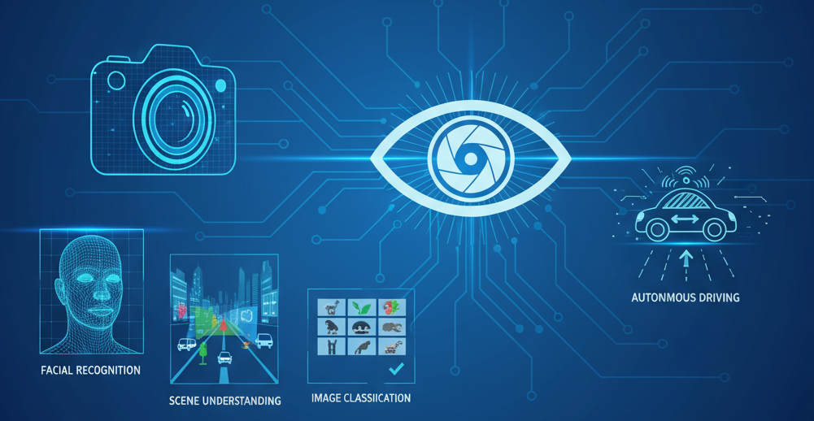
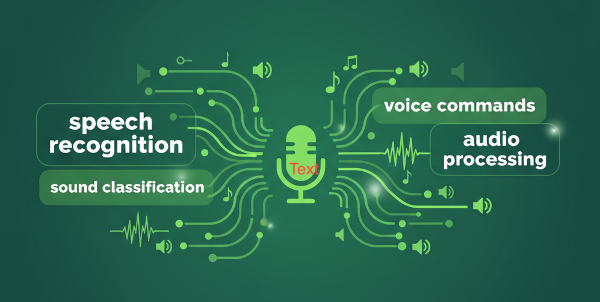
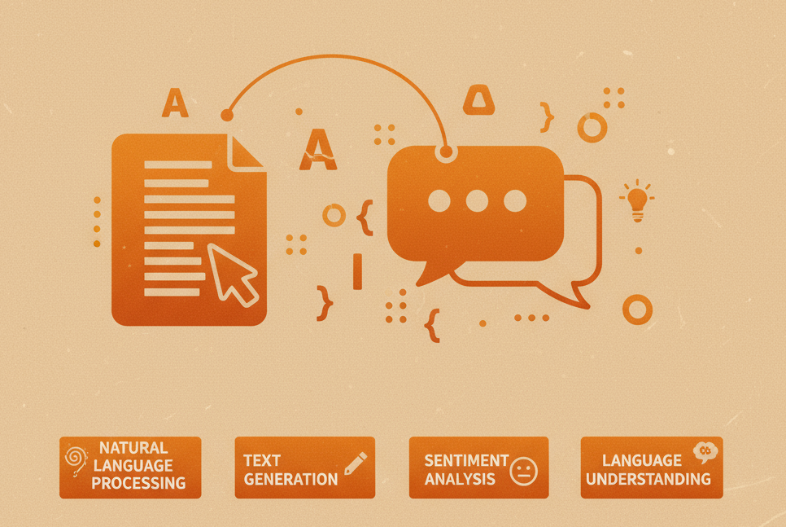
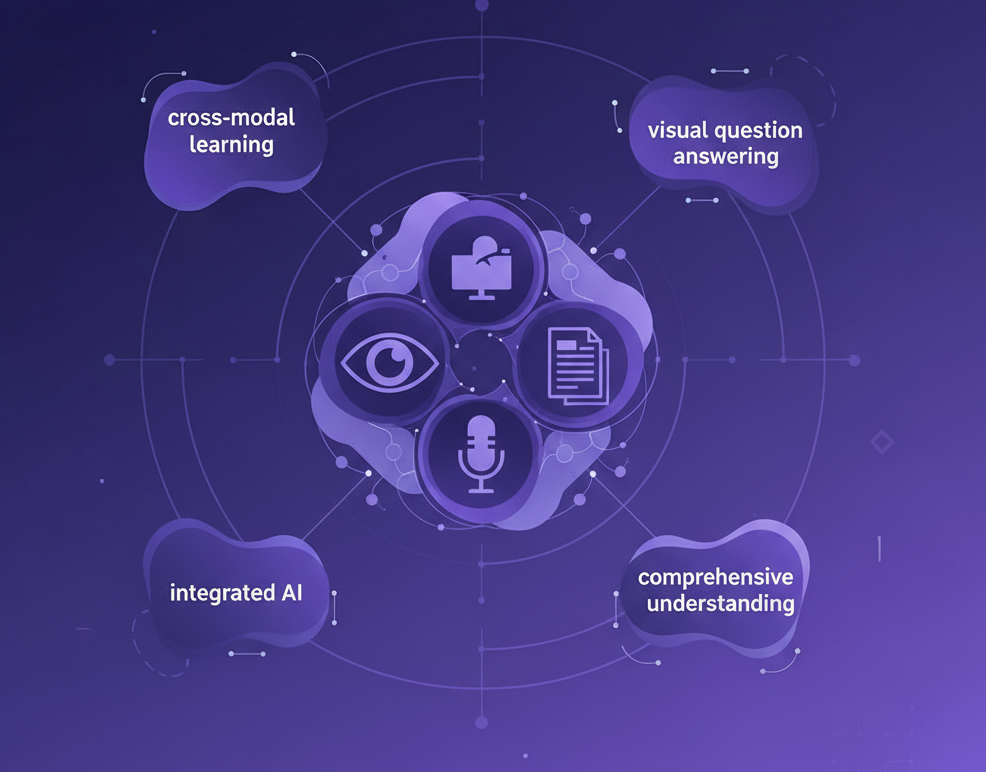

<div align="center">

<p><strong> 100+ Developer-first, CPU,GPU, MLX -friendly Hugging Face Models based notebooks with transparent measurements.</strong></p>

<p>
  <a href="/docs/gallery.md" style="padding:12px 20px;margin:4px;display:inline-block;border-radius:8px;background:#1f6feb;color:#fff;text-decoration:none;font-weight:600;">Notebook Gallery</a>
  <a href="/docs/fixes-and-tips.md" style="padding:12px 20px;margin:4px;display:inline-block;border-radius:8px;background:#0d1117;color:#fff;text-decoration:none;font-weight:600;">Fixes &amp; Tips</a>
  <a href="/docs/benchmarks.md" style="padding:12px 20px;margin:4px;display:inline-block;border-radius:8px;background:#6f42c1;color:#fff;text-decoration:none;font-weight:600;">Benchmark Highlights</a>
</p>

[](https://github.com/SSusantAchary/HuggingFace-HandsOn-Cookbook)
[](LICENSE)
[](https://huggingface.co/transformers)

</div>


### Credits- Information is Beautiful
---

### Quick Links
- [🧩 Hugging Face Ecosystem — Dev Quick Picks](#-hugging-face-ecosystem--dev-quick-picks)
- [What’s Inside](#whats-inside)
- [Quick Start](#quick-start)
- [🧾 AI Modalities](#ai-modalities)
## 🧩 Hugging Face Ecosystem — Dev Quick Picks
<br>
<sup>Opinionated, regularly used pieces that pair well with 🤗. Links go to official docs where possible.</sup>


<!-- ECOSYSTEM:START -->
<!-- generated by /scripts/build_ecosystem.py ; do not edit manually -->
| Category | Library | What it’s for | Where it fits |
|---|---|---|---|
| Core | [Transformers](https://huggingface.co/docs/transformers/index) | SOTA models across text/vision/audio/multimodal; training & inference | Model APIs, Trainer, generate() |
|  | [Datasets](https://huggingface.co/docs/datasets) | Stream/load/share datasets at scale | Data I/O, preprocessing, splits |
|  | [Tokenizers](https://huggingface.co/docs/tokenizers/index) | Fast Rust-backed tokenizers | Prod tokenization, custom vocab |
|  | [Evaluate](https://huggingface.co/docs/evaluate/index) | Metrics & eval pipelines | Reproducible metrics |
|  | [Diffusers](https://huggingface.co/docs/diffusers/index) | Diffusion models for images/video/audio | GenAI imaging/video |
| Training & Post-Training | [Accelerate](https://huggingface.co/docs/accelerate/index) | Device/distributed orchestration | Multi-GPU/TPU/MPS launch |
|  | [PEFT](https://huggingface.co/docs/peft/index) | LoRA/QLoRA & adapter training | Parameter-efficient finetuning |
|  | [TRL](https://huggingface.co/docs/trl/index) | SFT, DPO, PPO, RM for LLMs | Post-training & alignment |
|  | [DeepSpeed](https://www.deepspeed.ai/) | ZeRO + memory-efficient training | Large-model training via Trainer |
|  | [Optimum](https://huggingface.co/docs/optimum/index) | Hardware-specific speedups | ONNX, Intel, NVIDIA, AWS Neuron |
| Quant & Memory | [bitsandbytes](https://github.com/TimDettmers/bitsandbytes) | 8-bit / 4-bit loading & QLoRA | Low-VRAM inference/finetune |
| Serving & Deployment | [Text Generation Inference (TGI)](https://github.com/huggingface/text-generation-inference) | High-perf LLM serving | Prod text-gen endpoints |
|  | [Text Embeddings Inference (TEI)](https://github.com/huggingface/text-embeddings-inference) | High-perf embedding serving | Retrieval/semantic search |
|  | [huggingface_hub](https://huggingface.co/docs/huggingface_hub) | Programmatic Hub client | Push/pull models, datasets, Spaces |
| Hub, DataFrames & ETL | [Hub integrations (Polars/Pandas/DuckDB/Dask/Spark/Daft)](https://huggingface.co/docs/hub/en/extensions) | Write/read to Hub repos from tables | Dataset pipelines & exports |
| Apps & Demos | [Spaces + Gradio](https://huggingface.co/docs/hub/en/spaces-sdks-gradio) | Share interactive demos on the Hub | UI for notebooks & models |
<!-- ECOSYSTEM:END -->

How to suggest a library: [open an issue](https://github.com/SSusantAchary/HuggingFace-HandsOn-Cookbook/issues/new?template=01-suggest-ecosystem-library.md).

---


# AI Modalities (Click to Explore)

<div align="center">

| Vision 🖼️ | Audio 🔊 | Text 📝 | Multimodal 🌐 |
|:-----------:|:---------:|:-------:|:-------------:|
| <a href="notebooks/vision/vision_catalog.md"></a> | <a href="notebooks/audio/audio_catalog.md"></a> | <a href="notebooks/nlp/nlp_catalog.md"></a> | <a href="notebooks/multimodal/multimodal_catalog.md"></a> |
| 🛰️ Document OCR, layout analysis, zero-shot retrieval, grounding | 🎙️ Speech-to-text, diarization, tagging, captioning | 🧠 Instruction tuning, summarization, retrieval QA | 🤖 Cross-modal alignment, captioning, VQA, agentic flows |

</div>

---

### Quick Start
```bash
git clone https://github.com/SSusantAchary/HuggingFace-HandsOn-Cookbook.git
cd HuggingFace-HandsOn-Cookbook
python -m venv .venv && source .venv/bin/activate
pip install -r notebooks/requirements-minimal.txt
```
Open any notebook from `/notebooks` in Jupyter, VS Code, or Colab (badges inside each file).

## 🔍 Popular Vision OCR Highlights
- 🧾 **Trending models dashboard** → Dive into [Vision OCR Guide](notebooks/vision/OCR_models.md) for the latest `ocr` search snapshot, curated prompts, and resource links.
- 📒 **Nanonets-OCR2-3B** → Run the official [image2md cookbook](https://github.com/NanoNets/Nanonets-OCR2/blob/main/Nanonets-OCR2-Cookbook/image2md.ipynb) to turn PDFs into structured Markdown.
- 🪄 **dots.ocr** → Launch the [Colab remote server notebook](https://github.com/rednote-hilab/dots.ocr/blob/master/demo/demo_colab_remote_server.ipynb) for layout-aware parsing with table/formula support.
- 🌏 **Typhoon-OCR-7B** → Use the bilingual [Colab quick start](https://colab.research.google.com/drive/1z4Fm2BZnKcFIoWuyxzzIIIn8oI2GKl3r?usp=sharing) [](https://colab.research.google.com/drive/1z4Fm2BZnKcFIoWuyxzzIIIn8oI2GKl3r?usp=sharing) to process Thai/English documents.
- 📚 **Manga OCR base** → Follow the CLI [usage guide](https://github.com/kha-white/manga-ocr/blob/master/README.md#usage) for vertical, furigana-rich Japanese text.

## 🎨 Popular Vision Text-to-Image Highlights
- ⚡ **SD Turbo** → See the [Diffusers quickstart](https://huggingface.co/docs/diffusers/using-diffusers/sd_turbo) for 2–4 step 512² renders; works on 6GB GPUs or 8GB unified VRAM (M-series).
- 🖼️ **SDXL Base + Refiner** → Use the [SDXL text-to-image Colab](https://colab.research.google.com/github/huggingface/notebooks/blob/main/diffusers_doc/en/pytorch/sdxl.ipynb) [](https://colab.research.google.com/github/huggingface/notebooks/blob/main/diffusers_doc/en/pytorch/sdxl.ipynb) for photoreal 1024² generations (≥12GB GPU / 16GB unified).
- 🌀 **FLUX.1 family** → Try the [FLUX CFG Colab](https://colab.research.google.com/github/huggingface/notebooks/blob/main/diffusers/flux_with_cfg.ipynb) [](https://colab.research.google.com/github/huggingface/notebooks/blob/main/diffusers/flux_with_cfg.ipynb) for cinematic looks; expect 16–24GB VRAM or 24GB+ unified memory.
- 🌐 **Qwen-Image Lightning** → Multilingual prompts via the [Qwen2-Image Space](https://huggingface.co/spaces/Qwen/Qwen2-Image); plan on ≥16GB VRAM or 20GB unified.
- 🔡 **Stable Diffusion 3 Medium** → Follow the [SD3 pipeline docs](https://huggingface.co/docs/diffusers/api/pipelines/stable_diffusion_3) for better text rendering (≥18GB GPU / 32GB unified).

## 📒 Notebook Catalog (100+ models)
Developer-ready shortlist of Hugging Face models we plan to ship as notebooks. Full catalog refreshes from `/meta/notebook_catalog.csv`.

**Current coverage:** 100 models total  


| Section | Models |
|---|---|
| Audio | 25 |
| Multimodal | 20 |
| NLP | 20 |
| Vision | 35 |

## 📈 Top Downloaded HF Models


| Model | Pipeline | Downloads (M) |
|---|---|---|
| sentence-transformers/all-MiniLM-L6-v2 | sentence-similarity | 122.3 |
| Falconsai/nsfw_image_detection | image-classification | 119.9 |
| dima806/fairface_age_image_detection | image-classification | 77.6 |
| google/electra-base-discriminator | other | 64.7 |
| google-bert/bert-base-uncased | fill-mask | 52.6 |
| timm/mobilenetv3_small_100.lamb_in1k | image-classification | 33.5 |
| FacebookAI/roberta-large | fill-mask | 21.6 |
| openai/clip-vit-base-patch32 | zero-shot-image-classification | 18.5 |
| sentence-transformers/all-mpnet-base-v2 | sentence-similarity | 17.9 |
| pyannote/segmentation-3.0 | voice-activity-detection | 16.6 |


<!-- CATALOG:START -->
<!-- generated by /scripts/build_catalog.py ; do not edit manually -->
| Notebook | Use case | Deps | Hardware | RAM |
|---|---|---|---|---|
| **AUDIO** · [Whisper Tiny](https://huggingface.co/openai/whisper-tiny) | ASR on short clips (EN/multilingual) | transformers, torchaudio, soundfile | CPU/GPU/MLX | <4GB |
| **AUDIO** · [Wav2Vec2 Base 960h](https://huggingface.co/facebook/wav2vec2-base-960h) | ASR baseline (LibriSpeech-style) | transformers, torchaudio | CPU/GPU/MLX | 4–8GB |
| **AUDIO** · [Whisper Base](https://huggingface.co/openai/whisper-base) | Balanced ASR quality vs speed | transformers, torchaudio, soundfile | CPU/GPU/MLX | 4–8GB |
| **AUDIO** · [Whisper Small](https://huggingface.co/openai/whisper-small) | Improved ASR accuracy | transformers, torchaudio, soundfile | CPU/GPU/MLX | 8–16GB |
| **MULTIMODAL** · [CLIP ViT-B/32](https://huggingface.co/openai/clip-vit-base-patch32) | Zero-shot image classification & retrieval | transformers | CPU/GPU/MLX | 4–8GB |
| **MULTIMODAL** · [BLIP Captioning Base](https://huggingface.co/Salesforce/blip-image-captioning-base) | Image captioning on Flickr8k subset | transformers, datasets | CPU/GPU | 8–16GB |
| **MULTIMODAL** · [BLIP2 OPT 2.7B](https://huggingface.co/Salesforce/blip2-opt-2.7b) | Image captioning with OPT decoder | transformers | CPU/GPU | 16–32GB |
| **MULTIMODAL** · [CLIP ViT-L/14](https://huggingface.co/laion/CLIP-ViT-L-14) | High quality cross-modal retrieval | transformers | CPU/GPU | 8–16GB |
| **NLP** · [BERT base uncased](https://huggingface.co/bert-base-uncased) | Sentiment/IMDB baseline (CPU-first pipeline + LoRA TODO) | transformers, datasets, evaluate | CPU/GPU/MLX | <4GB |
| **NLP** · [all-MiniLM-L6-v2](https://huggingface.co/sentence-transformers/all-MiniLM-L6-v2) | Semantic search embeddings (vector DB ready) | sentence-transformers, transformers | CPU/GPU/MLX | <4GB |
| **NLP** · [RoBERTa base](https://huggingface.co/roberta-base) | Sentiment on social reviews baseline | transformers, datasets, evaluate | CPU/GPU/MLX | 4–8GB |
| **NLP** · [DistilBERT base uncased](https://huggingface.co/distilbert-base-uncased) | Real-time sentiment microservice | transformers, datasets | CPU/GPU/MLX | <4GB |
| **VISION** · [ViT Base 224](https://huggingface.co/google/vit-base-patch16-224) | Image classification baseline (Imagenette) | transformers, datasets, timm | CPU/GPU/MLX | 4–8GB |
| **VISION** · [DETR ResNet-50](https://huggingface.co/facebook/detr-resnet-50) | Object detection on sample images | transformers, torchvision | CPU/GPU | 8–16GB |
| **VISION** · [ResNet-50](https://huggingface.co/microsoft/resnet-50) | Classic classification transfer | torchvision, timm | CPU/GPU/MLX | 4–8GB |
| **VISION** · [CLIP ViT-B LAION](https://huggingface.co/laion/CLIP-ViT-B-32-laion2B-s34B-b79K) | Zero-shot retrieval large corpus | transformers | CPU/GPU | 4–8GB |

[View the full 100+ models catalog →](./notebooks/catalog.md)
<!-- CATALOG:END -->

### Who It's For
- Practitioners who need reproducible, CPU-GPU-MLX safe Hugging Face experiments.
- Teams validating Metal or CUDA paths without breaking CPU workflows. (MLX Coming Shortly)
- Contributors adding benchmarks, fixes, or doc polish with low friction.

**Prereqs:** Python ≥3.10, git, and `pip`. GPU/Metal optional.

### Mini-benchmark of the Week
- CLIP retrieval batch-size sweep scaffolding – see `/docs/benchmarks.md` and run the notebook to populate metrics.

### Credits
- [🤗 PEFT](https://github.com/huggingface/peft) — foundational adapter research and tooling referenced across the fine-tuning notes.
- [Unsloth Notebooks](https://docs.unsloth.ai/get-started/unsloth-notebooks) — high-efficiency Colab/Kaggle recipes linked throughout the PEFT/adapter cookbook.

### Cite & License
```
@misc{hands-on-hf,
  author    = {S.Susant Achary},
  title     = {HuggingFace-HandsOn-Cookbook},
  year      = {2025},
  howpublished = {\url{https://github.com/SSusantAchary/HuggingFace-HandsOn-Cookbook}}
}
```
Licensed under the [Apache License 2.0](LICENSE).

### Credits & Attributions
- Parameter-efficient finetuning patterns draw on the excellent [PEFT library](https://huggingface.co/docs/peft/index) from Hugging Face.
- Fast LoRA/DPO training inspiration and tooling credit to the [Unsloth project](https://github.com/unslothai/unsloth).

---

Questions or ideas? Open an issue with labels `notebook`, `fix`, `benchmark`, or `apple-silicon` to help us triage fast.
