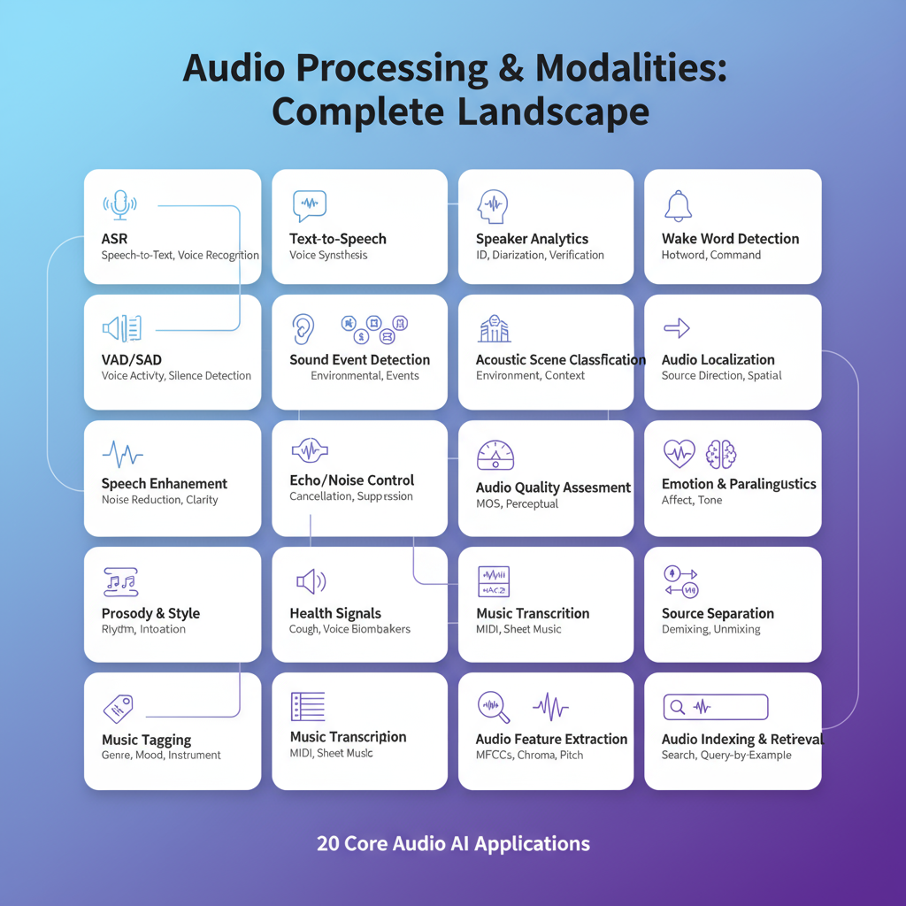

# Audio Notebook Catalog

  

| Model | Use case | Deps | Hardware | RAM | Notes | Notebook | Code |
|---|---|---|---|---|---|---|---|
| [Whisper Tiny](https://huggingface.co/openai/whisper-tiny) openai/whisper-tiny | ASR on short clips (EN/multilingual) | transformers, torchaudio, soundfile | CPU/GPU/MLX | <4GB | Install ffmpeg; good CPU baseline | audio/audio_notebooks/audio-01-whisper-tiny.ipynb |  [Whisper tiny/base ASR (HF pipeline)](https://github.com/huggingface/notebooks/blob/main/examples/automatic_speech_recognition.ipynb) |
| [Wav2Vec2 Base 960h](https://huggingface.co/facebook/wav2vec2-base-960h) facebook/wav2vec2-base-960h | ASR baseline (LibriSpeech-style) | transformers, torchaudio | CPU/GPU/MLX | 4–8GB | Works on CPU; add CTC decoding note | audio/audio_notebooks/audio-02-wav2vec2-base-960h.ipynb |  [Whisper fine-tuning (English subset)](https://colab.research.google.com/github/huggingface/notebooks/blob/main/examples/asr_fine_tuning_whisper.ipynb)  |
| [Whisper Base](https://huggingface.co/openai/whisper-base) openai/whisper-base | Balanced ASR quality vs speed | transformers, torchaudio, soundfile | CPU/GPU/MLX | 4–8GB | Use beam size 1 on CPU; ffmpeg needed | audio/audio_notebooks/audio-03-whisper-base.ipynb |  [wav2vec2 ASR (base-960h)](https://github.com/huggingface/notebooks/blob/main/examples/wav2vec2_asr.ipynb) |
| [Whisper Small](https://huggingface.co/openai/whisper-small) openai/whisper-small | Improved ASR accuracy | transformers, torchaudio, soundfile | CPU/GPU/MLX | 8–16GB | GPU recommended; add language settings | audio/audio_notebooks/audio-04-whisper-small.ipynb |  [HuBERT audio classification (SUPERB)](https://colab.research.google.com/github/huggingface/notebooks/blob/main/examples/audio_classification_superb.ipynb)  |
| [Whisper Medium](https://huggingface.co/openai/whisper-medium) openai/whisper-medium | High accuracy ASR | transformers, torchaudio, soundfile | CPU/GPU | 16–32GB | Plan quantization; GPU strongly advised | audio/audio_notebooks/audio-05-whisper-medium.ipynb |  [Keyword spotting (Speech Commands)](https://colab.research.google.com/github/huggingface/notebooks/blob/main/examples/keyword_spotting.ipynb)  |
| [Wav2Vec2 XLSR EN](https://huggingface.co/jonatasgrosman/wav2vec2-large-xlsr-53-english) jonatasgrosman/wav2vec2-large-xlsr-53-english | Multilingual ASR fine-tune | transformers, torchaudio | CPU/GPU | 8–16GB | Large memory; add vocab mapping | audio/audio_notebooks/audio-06-wav2vec2-xlsr-en.ipynb |  [Speaker verification (ECAPA-TDNN, SpeechBrain)](https://colab.research.google.com/github/speechbrain/speechbrain/blob/develop/recipes/VoxCeleb/SpeakerRec/SVECAPA.ipynb)  |
| [HuBERT Large](https://huggingface.co/facebook/hubert-large-ls960-ft) facebook/hubert-large-ls960-ft | Self-supervised ASR feature extractor | transformers, torchaudio | CPU/GPU | 8–16GB | Great for finetuning; MIT license | audio/audio_notebooks/audio-07-hubert-large.ipynb |  [Speaker diarization (pyannote)](https://colab.research.google.com/github/pyannote/pyannote-audio/blob/develop/tutorials/diarization_api.ipynb)  |
| [WavLM Base Plus](https://huggingface.co/microsoft/wavlm-base-plus) microsoft/wavlm-base-plus | Speech enhancement and ASR | transformers, torchaudio | CPU/GPU | 4–8GB | Use speechbrain recipes; MIT license | audio/audio_notebooks/audio-08-wavlm-base-plus.ipynb |  [Audio emotion recognition (SUPERB ER)](https://colab.research.google.com/github/superbbenchmark/superb/blob/master/notebook/SUPERB_ER_demo.ipynb)  |
| [WavLM Large](https://huggingface.co/microsoft/wavlm-large) microsoft/wavlm-large | Speaker diarization features | transformers, torchaudio | CPU/GPU | 8–16GB | Heavy but accurate; add VAD tip | audio/audio_notebooks/audio-09-wavlm-large.ipynb |  [TTS (Coqui-TTS basic colab)](https://colab.research.google.com/github/coqui-ai/TTS/blob/dev/notebooks/TTS_inference_demo.ipynb)  |
| [HuBERT Emotion](https://huggingface.co/superb/hubert-base-superb-er) superb/hubert-base-superb-er | Emotion classification | transformers, torchaudio | CPU/GPU | 4–8GB | Requires torchaudio>=2.1; check labels | audio/audio_notebooks/audio-10-hubert-emotion.ipynb |  [Voice activity detection (pyannote VAD)](https://colab.research.google.com/github/pyannote/pyannote-audio/blob/develop/tutorials/pipeline_demo.ipynb)  |
| [Wav2Vec2 Speaker ID](https://huggingface.co/superb/wav2vec2-base-superb-sid) superb/wav2vec2-base-superb-sid | Speaker identification | transformers, torchaudio | CPU/GPU | 4–8GB | Add enrollment pipeline; MIT | audio/audio_notebooks/audio-11-wav2vec2-speaker-id.ipynb |  [WavLM ASR / embeddings demo](https://colab.research.google.com/github/microsoft/unilm/blob/master/wavlm/notebooks/WavLM_Demo.ipynb)  |
| [UrbanSound8K ECAPA](https://huggingface.co/speechbrain/urbansound8k_ecapa) speechbrain/urbansound8k_ecapa | Urban sound classification | speechbrain, torchaudio | CPU/GPU | 4–8GB | Install ffmpeg; add data download step | audio/audio_notebooks/audio-12-urbansound8k-ecapa.ipynb |  [XLS-R multilingual ASR](https://colab.research.google.com/github/patrickvonplaten/notebooks/blob/master/Fine_tune_XLSR_Wav2Vec2_on_Arabic_ASR_with_Common_Voice.ipynb)  |
| [ECAPA VoxCeleb](https://huggingface.co/speechbrain/spkrec-ecapa-voxceleb) speechbrain/spkrec-ecapa-voxceleb | Speaker verification embeddings | speechbrain, torchaudio | CPU/GPU | 4–8GB | Add score calibration tip | audio/audio_notebooks/audio-13-ecapa-voxceleb.ipynb |  [Audio tagging (UrbanSound8K with HF)](https://colab.research.google.com/github/sanchit-gandhi/notebooks/blob/main/audio_classification_hf.ipynb)  |
| [Wav2Vec2 Emotion](https://huggingface.co/speechbrain/emotion-recognition-wav2vec2-IEMOCAP) speechbrain/emotion-recognition-wav2vec2-IEMOCAP | Emotion recognition pipeline | speechbrain, torchaudio | CPU/GPU | 8–16GB | GPU improves speed; MIT license | audio/audio_notebooks/audio-14-wav2vec2-emotion.ipynb |  [Streaming ASR with transformers](https://colab.research.google.com/github/huggingface/notebooks/blob/main/examples/asr_streaming.ipynb)  |
| [Speech Commands CNN](https://huggingface.co/speechbrain/google-speech-commands-cnn) speechbrain/google-speech-commands-cnn | Keyword spotting quickstart | speechbrain, torchaudio | CPU/GPU/MLX | <4GB | Great edge baseline; add noise aug | audio/audio_notebooks/audio-15-speech-commands-cnn.ipynb |  [Textless NLP (HuBERT units) demo](https://colab.research.google.com/github/facebookresearch/textlesslib/blob/main/notebooks/demo.ipynb)  |
| [MIMIC VoiceBank](https://huggingface.co/speechbrain/mtl-mimic-voicebank) speechbrain/mtl-mimic-voicebank | Speech enhancement baseline | speechbrain, torchaudio | CPU/GPU | 4–8GB | Needs noise dataset; MIT license | audio/audio_notebooks/audio-16-mimic-voicebank.ipynb |  [Music tagging with AST](https://colab.research.google.com/github/qiuqiangkong/audioset_tagging_cnn/blob/master/colab/ast_audioset_demo.ipynb)  |
| [SpeechT5 TTS](https://huggingface.co/microsoft/speecht5_tts) microsoft/speecht5_tts | Text-to-speech neural | transformers, torchaudio | CPU/GPU | 8–16GB | Requires HiFi-GAN vocoder; MIT license | audio/audio_notebooks/audio-17-speecht5-tts.ipynb |  [Silero VAD + ASR integration](https://colab.research.google.com/github/snakers4/silero-models/blob/master/examples/silero_vad_colab.ipynb)  |
| [XTTS v2](https://huggingface.co/coqui/XTTS-v2) coqui/XTTS-v2 | Multi-speaker TTS | TTS, torch | CPU/GPU | 16–32GB | Check Coqui license; needs ffmpeg | audio/audio_notebooks/audio-18-xtts-v2.ipynb |  [Audio augmentation & features (librosa)](https://colab.research.google.com/github/musikalkemist/AudioSignalProcessingForML/blob/master/03-Audio-Data-Augmentation.ipynb)  |
| [VITS LJSpeech](https://huggingface.co/espnet/kan-bayashi_ljspeech_vits) espnet/kan-bayashi_ljspeech_vits | Fast TTS baseline | espnet, torchaudio | CPU/GPU | 8–16GB | Warm up for better quality; MIT | audio/audio_notebooks/audio-19-vits-ljspeech.ipynb |  [torchaudio pipeline tutorial](https://colab.research.google.com/github/pytorch/tutorials/blob/main/beginner_source/audio_classifier_tutorial.ipynb)  |
| [MMS TTS EN](https://huggingface.co/facebook/mms-tts-eng) facebook/mms-tts-eng | Multilingual MMS TTS | transformers, torchaudio | CPU/GPU | 8–16GB | License review: MMS; add phoneme note | audio/audio_notebooks/audio-20-mms-tts-en.ipynb |  [Audio to embeddings (CLAP/LAION)](https://colab.research.google.com/github/LAION-AI/CLAP/blob/main/notebooks/CLAP_demo.ipynb)  |
| [Whisper Large V3](https://huggingface.co/openai/whisper-large-v3) openai/whisper-large-v3 | Flagship multilingual ASR | transformers, torchaudio, soundfile | GPU | 24–48GB | Requires segmented decoding + flash attention | audio/audio_notebooks/audio-21-whisper-large-v3.ipynb |  [Whisper large inference tips](https://huggingface.co/blog/whisper) |
| [Whisper Large V3 Turbo](https://huggingface.co/openai/whisper-large-v3-turbo) openai/whisper-large-v3-turbo | Low-latency Whisper for live captioning | transformers, torchaudio, soundfile | GPU | 12–24GB | Optimized for <1s latency; pair with quantized weights | audio/audio_notebooks/audio-22-whisper-large-v3-turbo.ipynb |  [HF Whisper streaming example](https://huggingface.co/blog/whisper-streaming) |
| [Pyannote Speaker Diarization](https://huggingface.co/pyannote/speaker-diarization-3.1) pyannote/speaker-diarization-3.1 | Speaker diarization + diarization-aware ASR | pyannote.audio, torch | GPU | 12–24GB | Needs SAD + embedding checkpoints pulled via HF Hub | audio/audio_notebooks/audio-23-pyannote-diarization.ipynb |  [Pyannote diarization tutorial](https://huggingface.co/pyannote) |
| [Pyannote Voice Activity](https://huggingface.co/pyannote/voice-activity-detection) pyannote/voice-activity-detection | Voice activity detection front-end | pyannote.audio, torch | CPU/GPU | 4–8GB | Great for gating streaming Whisper pipelines | audio/audio_notebooks/audio-24-pyannote-vad.ipynb |  [Pyannote VAD notebook](https://huggingface.co/pyannote/voice-activity-detection) |
| [MMS Forced Aligner](https://huggingface.co/MahmoudAshraf/mms-300m-1130-forced-aligner) MahmoudAshraf/mms-300m-1130-forced-aligner | Multilingual speech-text forced alignment | transformers, torchaudio | GPU | 12–24GB | Supports 100+ languages; pre-download MMS tokenizer weights | audio/audio_notebooks/audio-25-mms-300m-aligner.ipynb |  [Meta MMS forced alignment guide](https://huggingface.co/meta-llama) |

_Source of truth: `/meta/notebook_catalog.csv`._

## Task-Specific Audio Datasets

| Task | Dataset | Size | Link |
|---|---|---|---|
| Speech Enhancement | Voicebank-Demand | 28 speakers, 35 noise types | [Download](https://datashare.ed.ac.uk/handle/10283/2791)  |
| Keyword Spotting | Google Speech Commands V2 | 105k utterances | [Download](https://ai.googleblog.com/2017/08/launching-speech-commands-dataset.html)  |
| Emotion Recognition | IEMOCAP | ~12 hours dyadic sessions | [Download](https://sail.usc.edu/iemocap/)  |
| Environmental Sound Classification | ESC-50 | 2,000 clips across 50 classes | [Download](https://github.com/karoldvl/ESC-50)  |
| Music Emotion Recognition | Emotify | 400 tracks with affect annotations | [Download](https://zenodo.org/record/3514953)  |
| Music Recommendation | Million Song Dataset | 1M tracks metadata | [Download](http://millionsongdataset.com/)  |
| Music Captioning | MusicCaps | 5,521 music-text pairs | [Download](https://www.kaggle.com/datasets/googleai/musiccaps)  |
| Drum Transcription | Groove MIDI | 1,150 performances | [Download](https://magenta.tensorflow.org/datasets/groove)  |
| Speech Translation | CoVoST 2 | 2,900 hours, 21 languages | [Download](https://github.com/facebookresearch/covost)  |
| Speech Translation | MuST-C | 3,600 hours, 14 language pairs | [Download](https://aclanthology.org/N19-1202.pdf)  |
| Sound Event Detection | DCASE Challenge | Varies by year | [Download](http://dcase.community/challenge2024)  |
| Source Separation | MUSDB18-HQ | 150 songs (unaligned) | [Download](https://sigsep.github.io/datasets/musdb.html)  |

## Audio Datasets

| Title | Full Name | Size | Link |
| -------- | -------- | -------- | -------- |
| CommonVoice 11 | CommonVoice: A Massively Multilingual Speech Corpus | 58,250 voices (2,508 hours) | [Download](https://voice.mozilla.org/en/datasets)  |
| Libri-Light | Libri-Light: A Benchmark for ASR with Limited or No Supervision | 60,000 hours | [Download](https://ai.facebook.com/tools/libri-light)  |
| Wenetspeech | Wenetspeech: A 10000+ hours multi-domain Mandarin corpus for speech recognition | 10,000 hours | [Download](https://github.com/wenet-e2e/WenetSpeech)  |
| Gigaspeech | Gigaspeech: An evolving, multi-domain ASR corpus with 10,000 hours of transcribed audio | 50,000 hours | [Download](https://github.com/SpeechColab/GigaSpeech)  |
| MuST-C | MuST-C: a Multilingual Speech Translation Corpus | 3,600 hours | [Download](https://aclanthology.org/N19-1202.pdf)  |
| VoxPopuli | VoxPopuli: A Large-Scale Multilingual Speech Corpus for Representation Learning, Semi-Supervised Learning and Interpretation | 400k hours | [Download](https://github.com/facebookresearch/voxpopuli)  |
| CoVoST | CoVoST: A Large-Scale Multilingual Speech-To-Text Translation Corpus | 2,280 hours | [Download](https://github.com/facebookresearch/covost)  |
| CVSS | CVSS: A Massively Multilingual Speech-to-Speech Translation Corpus | 3,909 hours | [Download](https://github.com/google-research-datasets/cvss)  |
| EMIME | The EMIME bilingual database | – | [Download](https://www.emime.org/participate/emime-bilingual-database.html)  |
| Audiocaps | Audiocaps: Generating captions for audios in the wild | 46,000 audios | [Download](https://github.com/cdjkim/audiocaps)  |
| Clotho | Clotho: An audio captioning dataset | 4,981 audios • 24,905 captions | [Download](https://zenodo.org/record/3490684)  |
| AudioSet | AudioSet: An ontology and human-labeled dataset for audio events | 5.8k hours | [Download](https://g.co/audioset)  |
| EMOPIA | EMOPIA: A multi-modal pop piano dataset for emotion recognition and emotion-based music generation | 387 piano solo tracks | [Download](https://zenodo.org/record/5090631)  |
| MetaMIDI | Building the MetaMIDI Dataset: Linking Symbolic and Audio Musical Data | 436,631 MIDI files | [Download](#)  |
| DALI2 | Creating DALI, a Large Dataset of Synchronized Audio, Lyrics, and Notes | 7,756 songs | [Download](https://github.com/gabolsgabs/DALI)  |
| MillionMIDI | Million MIDI Dataset (MMD) | 100k songs | [Download](#)  |
| VGGSound | VGGSound: A Large-Scale Audio-Visual Dataset | 200k videos | [Download](https://www.robots.ox.ac.uk/~vgg/data/vggsound/)  |
| FSD50K | FSD50K: An Open Dataset of Human-Labeled Sound Events | 51,197 sound clips | [Download](https://zenodo.org/record/4060432)  |
| Symphony | Symphony generation with permutation invariant language model | 46,359 MIDI files | [Download](https://symphonynet.github.io/)  |
| MusicCaps | MusicLM: Generating Music From Text | 5,521 music-text pairs | [Download](https://www.kaggle.com/datasets/googleai/musiccaps)  |
| Jamendo | The MTG-Jamendo dataset for automatic music tagging | 55,525 tracks | [Download](https://github.com/MTG/mtg-jamendo-dataset)  |
| JamendoMaxCaps | JamendoMaxCaps: A Large-Scale Music-caption Dataset with Imputed Metadata | 25,356 hours • 362,238 songs | [Download](https://huggingface.co/datasets/amaai-lab/JamendoMaxCaps)  |
| MusicBench | Mustango: Toward Controllable Text-to-Music Generation | 53,168 tracks | [Download](https://huggingface.co/datasets/amaai-lab/MusicBench)  |
