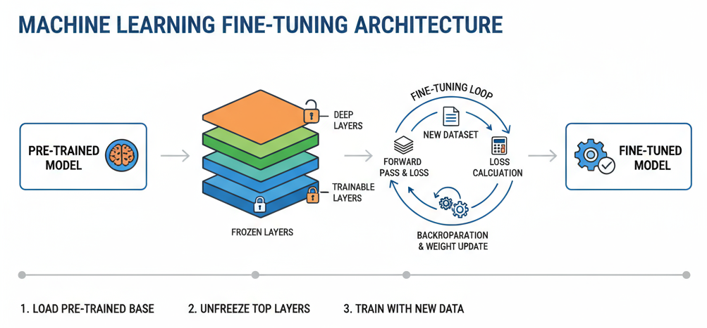
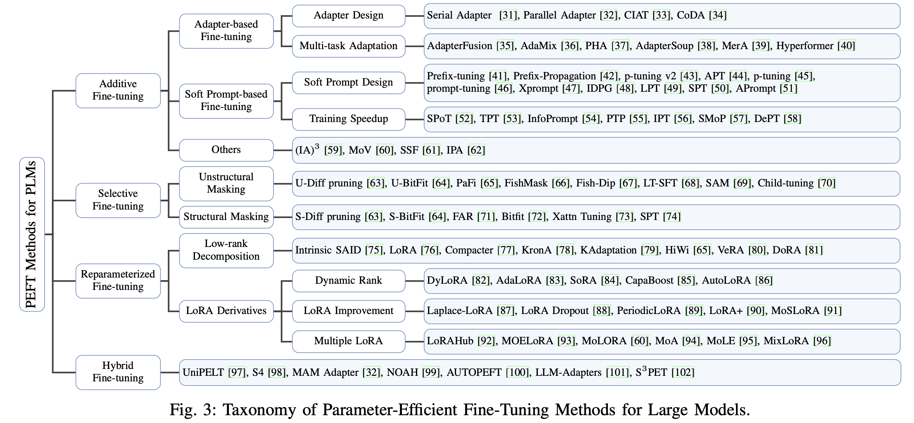

# Fine-Tuning Overview



## What
Fine-tuning adapts a pre-trained foundation model to a narrower task or domain by continuing training on a curated dataset while keeping most model weights close to their original values.

## Why
- Achieve higher task accuracy with significantly fewer training steps and data than full pre-training.
- Inject organization-specific knowledge without sharing proprietary data publicly.
- Reduce inference cost by specializing a smaller model instead of deploying a huge general model.

## How
1. Start from a high-quality base checkpoint (e.g., Llama, Mistral, Phi).
2. Prepare domain/task data with clear instructions, consistent formatting, and quality filtering.
3. Select a fine-tuning recipe (full, LoRA/QLoRA, adapters, prompt tuning).
4. Train with conservative learning rates, gradient clipping, and frequent evaluation to avoid catastrophic forgetting.
5. Validate on held-out data and safety tests before promoting to staging/production.

## Approach
- Align data schema: instruction-response, chat templates, or function-calling formats.
- Monitor loss curves plus qualitative evals (hallucination checks, rubric scoring).
- Incrementally scale context length or quantization only after the model is stable.
- Track experiment metadata (hyperparameters, dataset hashes, commit IDs) for reproducibility.

## Tools & Libraries
- **PEFT (Parameter-Efficient Fine-Tuning):** Deeply integrated with Transformers, Diffusers, and Accelerate; recipes such as LoRA keep >99.8% of weights frozen (the Qwen2.5‑3B example in the README trains only 0.1193% ≈3.7M params), yielding 19 MB adapters instead of 11 GB checkpoints while matching full fine-tune quality.
- **unSloth:** End-to-end fine-tuning stack that auto-configures paged optimizers, 4/8/16-bit loaders, and gradient checkpointing so you can train Llama/Qwen/Gemma classes up to 2× faster with as much as 70% less VRAM directly from Colab, Kaggle, or Docker notebooks.
- **Transformers + Accelerate:** High-level training loop orchestration, mixed precision, distributed multi-GPU support.
- **Datasets + Evaluate:** Streaming dataset prep, metrics calculation, and experiment tracking integrations.

## PEFT Essentials (README highlights)



- Memory efficiency: bigscience/T0_3B drops from 47.14 GB GPU to 14.4 GB with plain LoRA (9.8 GB with DeepSpeed CPU offload) on the RAFT twitter_complaints task, making 12B models trainable on a single A100 80 GB card.
- Adapter lifecycle: `add_adapter`, `load_adapter`, and `set_adapter` let you hot-swap domain adapters without reloading the backbone; adapters can also be merged for inference.
- Cross-modal reach: the Stable Diffusion v1‑4 LoRA recipe cuts GPU needs from 27.5 GB to 15.5 GB (8.12 GB w/ gradient checkpointing) and produces an 8.8 MB checkpoint, so vision models benefit just like LLMs.
- Quantization synergy: PEFT’s QLoRA, IA3, and soft prompts pair with 4/8-bit loaders plus Accelerate to fit 7B+ checkpoints on consumer hardware while maintaining stability.

## PEFT Approach Playbook (with code)

### LoRA (Low-Rank Adapters)
- Inserts rank-decomposed matrices into attention/feed-forward projections so only a handful of additional parameters (~0.1% of total) are trained.
- Works best when you want fast iterations and the ability to swap multiple domain adapters onto the same base checkpoint.

```python
from transformers import AutoModelForCausalLM, AutoTokenizer
from peft import LoraConfig, TaskType, get_peft_model

model_id = "Qwen/Qwen2.5-3B-Instruct"
tokenizer = AutoTokenizer.from_pretrained(model_id)
base_model = AutoModelForCausalLM.from_pretrained(model_id, device_map="auto")

lora_cfg = LoraConfig(
    r=16,
    lora_alpha=32,
    target_modules=["q_proj", "v_proj"],
    task_type=TaskType.CAUSAL_LM,
)
model = get_peft_model(base_model, lora_cfg)
```

### QLoRA (Quantized LoRA)
- Applies 4-bit NF4 quantization to the frozen base model while keeping LoRA adapters in 16-bit, giving the same quality as LoRA with ~2× lower VRAM.
- Ideal for laptops or 24 GB GPUs that still need to fine-tune 7B–14B checkpoints.

```python
import torch
from transformers import AutoModelForCausalLM, BitsAndBytesConfig
from peft import LoraConfig, TaskType, get_peft_model

bnb_cfg = BitsAndBytesConfig(
    load_in_4bit=True,
    bnb_4bit_use_double_quant=True,
    bnb_4bit_compute_dtype=torch.float16,
)
base_model = AutoModelForCausalLM.from_pretrained(
    "meta-llama/Llama-2-7b-chat-hf",
    device_map="auto",
    quantization_config=bnb_cfg,
)
qlora_cfg = LoraConfig(r=64, lora_alpha=16, lora_dropout=0.05, task_type=TaskType.CAUSAL_LM)
model = get_peft_model(base_model, qlora_cfg)
```

### Prompt / Prefix Tuning
- Keeps the backbone untouched and learns a small set of “virtual tokens” (prompt tuning) or key/value prefixes (prefix tuning) that steer generation.
- Useful when you need ultra-light adapters (<100 KB) or want to condition different behaviors at inference time.

```python
from transformers import AutoModelForCausalLM
from peft import PromptTuningConfig, PromptTuningInit, TaskType, get_peft_model

base_model = AutoModelForCausalLM.from_pretrained("mistralai/Mistral-7B-Instruct-v0.3")
prompt_cfg = PromptTuningConfig(
    task_type=TaskType.CAUSAL_LM,
    num_virtual_tokens=32,
    prompt_tuning_init=PromptTuningInit.TEXT,
    prompt_tuning_init_text="Answer like an empathetic support agent.",
)
model = get_peft_model(base_model, prompt_cfg)
```

### IA³ (Input-Output Activation Scaling)
- Learns multiplicative scaling vectors for attention/value activations, avoiding any new matrices while still adapting behavior.
- Handy when LoRA’s additional projections are too heavy but you still need more expressiveness than prompt tuning.

```python
from transformers import AutoModelForSeq2SeqLM
from peft import IA3Config, TaskType, get_peft_model

base_model = AutoModelForSeq2SeqLM.from_pretrained("google/flan-t5-large")
ia3_cfg = IA3Config(task_type=TaskType.SEQ_2_SEQ_LM)
model = get_peft_model(base_model, ia3_cfg)
```

### Adapter Lifecycle Tips
- `model.save_pretrained("adapter-name")` stores only the lightweight PEFT parameters; later `PeftModel.from_pretrained` can merge them back for inference.
- Use `model.merge_and_unload()` after training when you want a single fused checkpoint for deployment on runtimes that do not support adapters.

## Adapter Reference (Mechanics + Code)
_All snippets assume `from peft import get_peft_model` and a `transformers` model named `base_model` already loaded._

### LoRA
Low-Rank Adaptation adds two low-rank matrices per targeted projection so only `r * (in + out)` weights are trained while the backbone stays frozen.
```python
from peft import LoraConfig

cfg = LoraConfig(r=16, lora_alpha=32, target_modules=["q_proj", "v_proj"])
model = get_peft_model(base_model, cfg)
```

### AdaLoRA
AdaLoRA monitors singular values per adapter and reallocates rank to more important layers during a budgeting phase, squeezing higher accuracy out of the same parameter budget.
```python
from peft import AdaLoraConfig

cfg = AdaLoraConfig(
    r=64,
    lora_alpha=64,
    target_modules=["q_proj", "v_proj"],
    beta=0.85,
    total_step=1000,
)
model = get_peft_model(base_model, cfg)
```

### IA3
IA3 (Input-Output Activation Scaling) multiplies learned vectors onto key/value activations so no new matrices are introduced, just per-dimension scaling.
```python
from peft import IA3Config

cfg = IA3Config(target_modules=["k_proj", "v_proj"])
model = get_peft_model(base_model, cfg)
```

### Llama-Adapter (Adaption Prompt)
Adaption prompts inject trainable pseudo tokens into the self-attention stack (popularized by Llama-Adapter) so instruction tokens steer attention without touching the backbone weights.
```python
from peft.tuners.adaption_prompt import AdaptionPromptConfig

cfg = AdaptionPromptConfig(adapter_len=16, adapter_layers=4)
model = get_peft_model(base_model, cfg)
```

### LoHa (LyCORIS family)
LoHa replaces the usual matrix product with a Hadamard (element-wise) product between four low-rank matrices so you get higher effective rank with the same parameter count—great for diffusion/vision heads.
```python
from peft.tuners.loha import LoHaConfig

cfg = LoHaConfig(r=8, alpha=16, target_modules="conv_in")
model = get_peft_model(base_model, cfg)
```

### LoKr (LyCORIS family)
LoKr expresses the delta weights with Kronecker products, yielding block-structured updates that preserve the original rank and work well for image generators.
```python
from peft.tuners.lokr import LoKrConfig

cfg = LoKrConfig(r=8, alpha=16, target_modules="attn1")
model = get_peft_model(base_model, cfg)
```

### LyCORIS
LyCORIS is the umbrella toolkit that generalizes LoRA-style adapters (LoHa, LoKr, LoCon, etc.) with shared rank/alpha patterns so diffusion workflows can mix and match adapter math.
```python
from peft.tuners.lycoris_utils import LycorisConfig

cfg = LycorisConfig(r=8, alpha_pattern={"^down_blocks.*": 32})
model = get_peft_model(base_model, cfg)
```

### OSF (Orthogonal Subspace Fine-tuning)
OSF preserves the top singular vectors of each weight matrix (the “high subspace”) and only trains the orthogonal complement, keeping core skills intact while adapting the remainder.
```python
from peft.tuners.osf import OSFConfig

cfg = OSFConfig(effective_rank=0.5, target_modules="q_proj")
model = get_peft_model(base_model, cfg)
```

### X-LoRA
X-LoRA is a mixture-of-experts LoRA where gating networks select which LoRA experts fire per token/layer, enabling multi-domain skills without swapping checkpoints.
```python
from peft.tuners.xlora import XLoraConfig

cfg = XLoraConfig(r=8, num_experts=4, target_modules=["q_proj", "v_proj"])
model = get_peft_model(base_model, cfg)
```

### Multitask Prompt Tuning
Multitask Prompt Tuning distills several task-specific prompts into a shared prompt and then adds low-rank tweaks per task so you can serve many tasks from one checkpoint.
```python
from peft.tuners.multitask_prompt_tuning import MultitaskPromptTuningConfig

cfg = MultitaskPromptTuningConfig(
    num_virtual_tokens=64,
    prompt_tuning_init="AVERAGE_SOURCE_TASKS",
    num_tasks=4,
)
model = get_peft_model(base_model, cfg)
```

### OFT (Orthogonal Finetuning)
OFT learns block-diagonal orthogonal rotations that preserve neuron cosine similarities, so the adapted model keeps its subject/style while nudging directions gently.
```python
from peft.tuners.oft import OFTConfig

cfg = OFTConfig(r=64, target_modules="k_proj")
model = get_peft_model(base_model, cfg)
```

### BOFT (Butterfly Orthogonal Finetuning)
BOFT factorizes OFT’s rotations into sparse butterfly matrices, giving you dense neuron mixing with only O(d log d) parameters—a better fit for very large models.
```python
from peft.tuners.boft import BOFTConfig

cfg = BOFTConfig(rank=64, num_blocks=4, target_modules="v_proj")
model = get_peft_model(base_model, cfg)
```

### Polytropon (Poly/Multi-Head Routing)
Polytropon learns a bank of skills (LoRA blocks) plus routers that pick which skill to apply per task or head, so multitask models share capacity efficiently.
```python
from peft.tuners.poly import PolyConfig

cfg = PolyConfig(r=16, n_skills=4, n_tasks=3, target_modules=["q_proj"])
model = get_peft_model(base_model, cfg)
```

### P-tuning
P-tuning adds optimizer-learned embeddings (virtual tokens) anywhere in the sequence, trained via a prompt encoder, letting you learn flexible prompts without editing the vocabulary.
```python
from peft import PromptEncoderConfig

cfg = PromptEncoderConfig(task_type="CAUSAL_LM", num_virtual_tokens=32, encoder_hidden_size=768)
model = get_peft_model(base_model, cfg)
```

### Prefix Tuning
Prefix tuning prepends learned key/value vectors to every self-attention block, effectively biasing attention with almost no added latency.
```python
from peft.tuners.prefix_tuning import PrefixTuningConfig

cfg = PrefixTuningConfig(task_type="CAUSAL_LM", num_virtual_tokens=20)
model = get_peft_model(base_model, cfg)
```

### Prompt Tuning
Prompt tuning optimizes a fixed number of embeddings (virtual tokens) that are concatenated to the input—minimal params, fast to swap.
```python
from peft.tuners.prompt_tuning import PromptTuningConfig

cfg = PromptTuningConfig(task_type="SEQ_2_SEQ_LM", num_virtual_tokens=16, prompt_tuning_init="TEXT")
model = get_peft_model(base_model, cfg)
```

### LayerNorm Tuning
LayerNorm tuning only unfreezes the affine parameters of selected LayerNorms; it is the lightest possible adapter for quick domain shifts.
```python
from peft.tuners.ln_tuning import LNTuningConfig

cfg = LNTuningConfig(target_modules=["ln_f"])
model = get_peft_model(base_model, cfg)
```

### VeRA
VeRA initializes shared random projection matrices once and only learns diagonal scaling vectors, giving full-rank updates with LoRA-level memory cost.
```python
from peft.tuners.vera import VeraConfig

cfg = VeraConfig(r=256, target_modules="q_proj", save_projection=False)
model = get_peft_model(base_model, cfg)
```

### FourierFT
FourierFT parameterizes the weight delta in the frequency domain (learnable Fourier coefficients), so you can match LoRA quality with far fewer parameters on vision/NLP models.
```python
from peft.tuners.fourierft import FourierFTConfig

cfg = FourierFTConfig(n_frequency=1200, scaling=150.0, target_modules=["q_proj", "v_proj"])
model = get_peft_model(base_model, cfg)
```

### VB-LoRA (Vector-Bank LoRA)
VB-LoRA keeps a shared vector bank and only learns sparse top-k combinations of those vectors per layer, allowing you to cache reusable basis vectors.
```python
from peft.tuners.vblora import VBLoRAConfig

cfg = VBLoRAConfig(r=8, num_vectors=64, topk=4, target_modules="o_proj")
model = get_peft_model(base_model, cfg)
```

### HRA (Householder Reflection Adaptation)
HRA chains Householder reflections to form orthogonal transformations, blending OFT’s stability with LoRA’s efficiency; orthogonality regularizers keep reflections well-behaved.
```python
from peft.tuners.hra import HRAConfig

cfg = HRAConfig(r=32, apply_GS=True, target_modules=["k_proj", "v_proj"])
model = get_peft_model(base_model, cfg)
```

### CPT (Context-aware Prompt Tuning)
CPT augments prompt tuning with context encoders so the prompt adapts based on the input (great for retrieval-augmented or function-calling formats).
```python
from peft.tuners.cpt import CPTConfig

cfg = CPTConfig(num_virtual_tokens=32, encoder_hidden_size=768)
model = get_peft_model(base_model, cfg)
```

### Bone
Bone is an earlier MiSS-compatible checkpoint format; in PEFT you mainly convert Bone adapters to MiSS, but you can still instantiate them for legacy runs.
```python
from peft.tuners.bone import BoneConfig

cfg = BoneConfig(r=8, target_modules="q_proj")
model = get_peft_model(base_model, cfg)
```

### Trainable Tokens
Trainable Tokens lets you fine-tune only a subset of embedding rows (to add new vocabulary or personalize tokens) without touching the full embedding matrix.
```python
from peft.tuners.trainable_tokens import TrainableTokensConfig

token_ids = [tokenizer.convert_tokens_to_ids("[NEW_TAG]")]
cfg = TrainableTokensConfig(token_indices=token_ids)
model = get_peft_model(base_model, cfg)
```

### RandLoRA
RandLoRA builds a bank of random low-rank bases that span the full rank; training only scales these bases so you get full-rank updates while staying PEFT-friendly.
```python
from peft.tuners.randlora import RandLoraConfig

cfg = RandLoraConfig(r=4, num_bases=64, target_modules=["q_proj", "k_proj"])
model = get_peft_model(base_model, cfg)
```

### SHiRA
SHiRA masks LoRA-style matrices with structured sparsity and treats the surviving entries as a high-rank adapter; masking lets you push rank without the memory hit.
```python
from peft.tuners.shira import ShiraConfig

cfg = ShiraConfig(r=16, mask_type="random", target_modules="v_proj")
model = get_peft_model(base_model, cfg)
```

### C3A (Circular Convolution Adaptation)
C3A reshapes weights into blocks and applies circular convolutions so you approximate high-rank updates with lightweight convolutional kernels.
```python
from peft.tuners.c3a import C3AConfig

cfg = C3AConfig(block_size=32, r=8, target_modules="q_proj")
model = get_peft_model(base_model, cfg)
```

### MiSS (Matrix Shard Sharing)
MiSS shards matrices, shares a common fragment across shards, and learns how to recombine them; it hits higher ranks with fewer params and is backwards-compatible with Bone.
```python
from peft.tuners.miss import MissConfig

cfg = MissConfig(r=16, miss_dropout=0.05, target_modules=["q_proj", "v_proj"])
model = get_peft_model(base_model, cfg)
```

### RoAd
RoAd (Rotary Adapter) rotates neuron pairs with shared scale/phase parameters; different variants (road_1/2/4) control how granular those rotations are.
```python
from peft.tuners.road import RoadConfig

cfg = RoadConfig(variant="road_2", target_modules="o_proj")
model = get_peft_model(base_model, cfg)
```

### WaveFT
WaveFT operates in the wavelet domain: it learns a sparse set of wavelet coefficients, then reconstructs the delta weights via inverse DWT for strong diffusion personalization.
```python
from peft.tuners.waveft import WaveFTConfig

cfg = WaveFTConfig(n_frequency=4096, scaling=25.0, target_modules="to_out.0")
model = get_peft_model(base_model, cfg)
```

### DeLoRA
DeLoRA constrains the Frobenius norm of each delta weight via a learnable lambda so adapters never drift too far from the base model; module dropout gives additional regularization.
```python
from peft.tuners.delora import DeloraConfig

cfg = DeloraConfig(r=16, delora_lambda=20, module_dropout=0.05, target_modules="q_proj")
model = get_peft_model(base_model, cfg)
```

## `/fine-tuning/fine_tune_notebooks` Asset Index
The curated mirror at `fine-tuning/fine_tune_notebooks` keeps runnable demos, diagrams, and scripts close to the Cookbook for offline experimentation.

### Notebooks & demos
| Notebook | Focus |
| --- | --- |
| `fine-tuning/fine_tune_notebooks/sequence_classification/LoRA.ipynb` | Baseline LoRA fine-tuning on GLUE-style classification |
| `fine-tuning/fine_tune_notebooks/sequence_classification/IA3.ipynb` | IA³ adapter walkthrough with evaluation cells |
| `fine-tuning/fine_tune_notebooks/sequence_classification/VeRA.ipynb` | VeRA diagonal-scaling training loop and comparison plots |
| `fine-tuning/fine_tune_notebooks/sequence_classification/FourierFT.ipynb` | Frequency-domain adapter training + metrics logging |
| `fine-tuning/fine_tune_notebooks/sequence_classification/C3A.ipynb` | Circular Convolution Adaptation end-to-end example |
| `fine-tuning/fine_tune_notebooks/randlora_finetuning/qrandlora_finetuning.ipynb` | RandLoRA full-rank adapter demo (QLoRA friendly) |
| `fine-tuning/fine_tune_notebooks/conditional_generation/multitask_prompt_tuning.ipynb` | Multitask prompt sharing with train/eval hooks |
| `fine-tuning/fine_tune_notebooks/hra_dreambooth/dreambooth_inference.ipynb` | Householder Reflection Adaptation for SDXL DreamBooth |

Additional specialty notebooks live alongside these in `fine-tuning/fine_tune_notebooks/*` (e.g., BOFT/OFT/HRA DreamBooth, CPT, LoFTQ, adapters for DNA LMs, evaluation notebooks).

### Trainer & utility scripts
| Script | Technique | Notes |
| --- | --- | --- |
| `fine-tuning/fine_tune_notebooks/conditional_generation/peft_adalora_seq2seq.py` | AdaLoRA | Shows how to call `update_and_allocate` each step inside a custom Trainer. |
| `fine-tuning/fine_tune_notebooks/conditional_generation/peft_lora_seq2seq_accelerate_fsdp.py` | LoRA + FSDP | Turnkey script for multi-GPU seq2seq with PEFT adapters. |
| `fine-tuning/fine_tune_notebooks/conditional_generation/peft_lora_seq2seq_accelerate_ds_zero3_offload.py` | LoRA + DeepSpeed ZeRO-3 | Demonstrates CPU/NVME offload configs. |
| `fine-tuning/fine_tune_notebooks/causal_language_modeling/peft_lora_clm_accelerate_ds_zero3_offload.py` | LoRA CLM | Instruction-tuning ready CLM loop with extra tokens. |
| `fine-tuning/fine_tune_notebooks/boft_dreambooth/train_dreambooth.py` | BOFT | Wavelet-style orthogonal adapter training for diffusion. |
| `fine-tuning/fine_tune_notebooks/hra_dreambooth/train_dreambooth.py` | HRA | Chains Householder reflections while keeping SDXL stable. |
| `fine-tuning/fine_tune_notebooks/oft_dreambooth/train_dreambooth.py` | OFT | Orthogonal finetuning recipe for subject-driven diffusion. |
| `fine-tuning/fine_tune_notebooks/multi_adapter_examples/Lora_Merging.ipynb` (plus `PEFT_Multi_LoRA_Inference.ipynb`) | Adapter orchestration | Merge, weight, and route multiple LoRA checkpoints. |

### Documentation & guides
- `fine-tuning/fine_tune_notebooks/docs/source/conceptual_guides/adapter.md`: Adapter encyclopedia cited earlier (LoRA, LoHa, LoKr, AdaLoRA, X-LoRA, OFT/BOFT, HRA, MiSS, etc.).
- `fine-tuning/fine_tune_notebooks/docs/source/task_guides/lora_based_methods.md`: Applied LoRA variants with CLI examples and hyperparameter tips.
- `fine-tuning/fine_tune_notebooks/docs/source/task_guides/prompt_based_methods.md`: Prompt/prefix/P-tuning guides.
- `fine-tuning/fine_tune_notebooks/docs/source/package_reference/*.md`: API docs per adapter (C3A, RandLoRA, VB-LoRA, FourierFT, WaveFT, CPT, TrainableTokens, Road, DeLoRA, etc.).
- `fine-tuning/fine_tune_notebooks/docs/source/tutorial/peft_model_config.md`: How to mix configs, inspect adapter metadata, and push to Hub.
- `fine-tuning/fine_tune_notebooks/docs/source/developer_guides/mixed_models.md`: Loading multiple adapter types simultaneously.

### Images & screenshots
- `dwld/peft-main/examples/hra_dreambooth/a_purple_qwe_backpack.png`: Reference render used inside the HRA DreamBooth README to validate style preservation.
- Many docs embed hosted diagrams (LoRA animation, token-by-token scalings) linked directly in `docs/source/conceptual_guides/adapter.md`; keep those URLs handy when presenting slides.

### Technique & evaluation sandboxes
- `fine-tuning/fine_tune_notebooks/method_comparison/`: Reproducible experiments comparing C3A, FourierFT, RandLoRA, VeRA, etc., including config YAMLs and log parsing scripts.
- `fine-tuning/fine_tune_notebooks/scripts/convert-bone-to-miss.py`: Utility to migrate historical Bone adapters into the MiSS format before training further.
- `fine-tuning/fine_tune_notebooks/scripts/merge_peft_adapter.py`, `fine-tuning/fine_tune_notebooks/scripts/quantization/export_lora_to_gguf.py`: Operational helpers for deploying adapters.

### Paper references snapshot
| Adapter | Paper |
| --- | --- |
| LoRA | [2106.09685](https://huggingface.co/papers/2106.09685) |
| LoHa | [2108.06098](https://huggingface.co/papers/2108.06098) |
| LoKr | [2309.14859](https://huggingface.co/papers/2309.14859) |
| AdaLoRA | [2303.10512](https://huggingface.co/papers/2303.10512) |
| X-LoRA | [2402.07148](https://huggingface.co/papers/2402.07148) |
| OFT | [2306.07280](https://huggingface.co/papers/2306.07280) |
| BOFT | [2311.06243](https://huggingface.co/papers/2311.06243) |
| HRA | [2405.17484](https://huggingface.co/papers/2405.17484) |
| MiSS | [2409.15371](https://huggingface.co/papers/2409.15371) |
| RoAd | [2409.00119](https://huggingface.co/papers/2409.00119) |
| VB-LoRA | [2405.15179](https://huggingface.co/papers/2405.15179) |
| RandLoRA | [2502.00987](https://huggingface.co/papers/2502.00987) |
| C3A | [2407.19342](https://huggingface.co/papers/2407.19342) |
| FourierFT | [2405.03003](https://huggingface.co/papers/2405.03003) |

## unSloth Essentials (README highlights)
- Notebook-first UX: curated Colab/Kaggle notebooks cover gpt-oss 20B, Qwen3 14B, DeepSeek-OCR 3B, Llama 3.1 8B, Gemma 3, Orpheus-TTS, plus GRPO/GSPO reinforcement-learning runs—all reporting 1.5–2× speedups and 30–80% VRAM savings versus baseline PyTorch loops.
- Data flow: every notebook expects you to “bring your own dataset”; the reference code loads LAION’s OIG `unified_chip2.jsonl` via `datasets.load_dataset`, so swapping in internal instruction/vision/TTS data is a one-line change.
- Optimized kernels: `FastLanguageModel.get_peft_model` patches LoRA ranks, enables Unsloth’s gradient checkpointing mode (fits ~2× larger batches), and supports 4-bit pre-quantized checkpoints for faster downloads and zero-OOM fine-tuning.
- Full-stack coverage: Windows, Docker, and NVIDIA Blackwell/DGX-specific installers, plus RLHF (GRPO/GSPO/DrGRPO/PPO/DPO) notebooks, make it easy to extend from supervised fine-tunes into reward modeling.

### unSloth Notebook Catalog (docs.unsloth.ai)
| Notebook | Domain | Highlight | Link |
| --- | --- | --- | --- |
| gpt-oss (20B) Fine-Tuning | Instruction SFT | 1.5× faster epochs, 70% less VRAM | [Docs](https://docs.unsloth.ai/get-started/unsloth-notebooks#gpt-oss-20b-fine-tuning) |
| Qwen3 (14B) Reasoning-Chat | Conversational reasoning | 2× faster, long-context friendly | [Docs](https://docs.unsloth.ai/get-started/unsloth-notebooks#qwen-3-14b-reasoning-conversational) |
| DeepSeek-OCR (3B) | Multilingual OCR QA | +89% language understanding, TTS export | [Docs](https://docs.unsloth.ai/get-started/unsloth-notebooks#deepseek-ocr-3b) |
| GRPO RL (gpt-oss 20B) | Reinforcement Learning | Prebuilt GRPO loop with reward templates | [Docs](https://docs.unsloth.ai/get-started/unsloth-notebooks#grpo-reasoning-rl-notebooks) |
| Qwen3-VL (8B) Vision | Multimodal reasoning | 1.5× faster GSPO with 80% less VRAM | [Docs](https://docs.unsloth.ai/get-started/unsloth-notebooks#vision-multimodal-notebooks) |
| Gemma 3N (4B) Conversational | Edge assistants | 1.5× faster, low-memory recipe | [Docs](https://docs.unsloth.ai/get-started/unsloth-notebooks#gemma) |
| Llama 3.2 (3B/11B) | Conversational / Vision | Alpaca and multimodal fine-tunes | [Docs](https://docs.unsloth.ai/get-started/unsloth-notebooks#llama) |
| Mistral v0.3 (7B) | Conversational | Ready-to-run chat SFT notebook | [Docs](https://docs.unsloth.ai/get-started/unsloth-notebooks#mistral) |
| Phi-4 / Phi-3.5 | Conversational | Lightweight assistants for CPUs | [Docs](https://docs.unsloth.ai/get-started/unsloth-notebooks#phi) |
| Whisper Large | Speech recognition | End-to-end ASR finetuning | [Docs](https://docs.unsloth.ai/get-started/unsloth-notebooks#whisper) |
| TTS bundle (Orpheus/Sesame/Spark) | Text-to-speech | Multiple voices, GGUF export | [Docs](https://docs.unsloth.ai/get-started/unsloth-notebooks#text-to-speech-tts-notebooks) |
| Kaggle collection | Cloud notebook variants | Pre-configured GPU runtimes | [Docs](https://docs.unsloth.ai/get-started/unsloth-notebooks#kaggle-notebooks) |

## Infrastructure
- Single GPU workstation (A100, H100, 4090) for adapter-based or QLoRA runs up to ~70B params.
- Multi-GPU on-prem cluster or managed services (AWS Sagemaker, GCP Vertex) for full fine-tuning or larger batch sizes.
- Use Weights & Biases, MLflow, or Hugging Face Hub for logging, artifact storage, and model registry.

## Model Addition Plan
1. **Baseline coverage:** Start with PEFT-ready checkpoints (Llama 3.1 8B, Mistral 7B, Phi-3, Stable Diffusion v1‑4) and unSloth-optimized notebooks (gpt-oss 20B, Qwen3 14B, Gemma 3/3n, DeepSeek-OCR 3B) so we have both encoder-decoder and causal options.
2. **Dataset pairing:** Map each model to a target corpus (e.g., RAFT twitter_complaints for classification, internal chat data for instruction tuning, LAION OIG or synthetic reasoning traces for SFT/RL) and document token budgets per epoch.
3. **Adapter rollout:** Use PEFT’s `get_peft_model` or unSloth’s `FastLanguageModel` to generate LoRA/QLoRA adapters, track them in Hugging Face Hub, and keep backbone weights immutable for auditability.
4. **Evaluation & promotion:** Run held-out benchmarks (MT-Bench, TruthfulQA, in-domain rubrics) plus regression checks on base vs adapter variants; promote only if accuracy gains outweigh latency/cost deltas.
5. **Lifecycle automation:** Schedule monthly refreshes where new domain data is appended, adapters are retrained, and older adapters are archived but still loadable via `set_adapter`/`FastLanguageModel.merge_lora`.

## Performance Comparison: Base vs Fine-Tuned Models
- **General tasks:** Base models offer broad knowledge but weaker context alignment; fine-tuned models improve coherence and reduce refusal rates on target tasks.
- **Domain accuracy:** Expect +5–20 point gains on specialized benchmarks (e.g., legal QA, support chat) when fine-tuned on high-quality corpora.
- **Efficiency:** Adapter-based fine-tunes keep inference latency similar to the base model while drastically outperforming it on in-domain prompts.

### Performance Tables (from PEFT & unSloth READMEs)

**Adapter efficiency on RAFT twitter_complaints (A100 80 GB)**

| Model | Strategy | GPU Mem | CPU Mem | Data / Time insight | Performance insight |
| --- | --- | --- | --- | --- | --- |
| [bigscience/T0_3B](https://huggingface.co/bigscience/T0_3B) | Full fine-tune | 47.14 GB | 2.96 GB | Single-card run, but limited headroom for batching | Baseline reference for LoRA comparison |
| [bigscience/T0_3B](https://huggingface.co/bigscience/T0_3B) | LoRA (PEFT) | 14.4 GB | 2.96 GB | 3.3× GPU memory reduction; LoRA adapter trains only 0.1193% of weights | Accuracy 0.863 (vs Flan-T5 0.892) with 19 MB adapter instead of 11 GB checkpoint |
| [bigscience/T0_3B](https://huggingface.co/bigscience/T0_3B) | LoRA + DeepSpeed CPU offload | 9.8 GB | 17.8 GB | Fits comfortably on a single GPU; CPU RAM handles optimizer state | Comparable quality to full fine-tune while enabling larger batch sizes |
| [bigscience/mt0-xxl](https://huggingface.co/bigscience/mt0-xxl) | Full fine-tune | OOM | — | Not feasible on one 80 GB GPU | — |
| [bigscience/mt0-xxl](https://huggingface.co/bigscience/mt0-xxl) | LoRA | 56 GB | 3 GB | Becomes trainable without model parallelism | PEFT README reports parity with full FT on RAFT |
| [bigscience/mt0-xxl](https://huggingface.co/bigscience/mt0-xxl) | LoRA + DeepSpeed CPU offload | 22 GB | 52 GB | 2.5× VRAM savings; shifts memory pressure to CPU | Same dataset/time budget while unlocking 12B scale |

**unSloth notebook speedups (bring-your-own-dataset)**

| Model notebook | Reported perf gain | VRAM reduction | Default data profile | Notes |
| --- | --- | --- | --- | --- |
| [gpt-oss 20B SFT](https://colab.research.google.com/github/unslothai/notebooks/blob/main/nb/gpt-oss-(20B)-Fine-tuning.ipynb) | 1.5× faster epochs | 70% less VRAM | Instruction tuning (e.g., LAION OIG unified_chip2) | 4-bit checkpoints download faster; export to GGUF/Ollama |
| [Qwen3 14B reasoning chat](https://colab.research.google.com/github/unslothai/notebooks/blob/main/nb/Qwen3_(14B)-Reasoning-Conversational.ipynb) | 2× faster | 70% less | User conversation/reasoning traces | Ideal for long-context chat thanks to Unsloth checkpointing |
| [DeepSeek-OCR 3B](https://colab.research.google.com/github/unslothai/notebooks/blob/main/nb/Deepseek_OCR_(3B).ipynb) | 1.5× faster | 30% less | Multilingual OCR QA pairs | README cites +89% language understanding after tuning |
| [gpt-oss 20B GRPO](https://colab.research.google.com/github/unslothai/notebooks/blob/main/nb/gpt-oss-(20B)-GRPO.ipynb) | 2× faster RL loops | 80% less | Reward traces / preference data | Ready-to-run GRPO notebook for reasoning RLHF |
| [Qwen3-VL 8B GSPO](https://colab.research.google.com/github/unslothai/notebooks/blob/main/nb/Qwen3_VL_(8B)-Vision-GRPO.ipynb) | 1.5× faster | 80% less | Vision-language pair datasets | Vision RL notebooks share same infra |
| [Llama 3.1 8B Alpaca](https://colab.research.google.com/github/unslothai/notebooks/blob/main/nb/Llama3.1_(8B)-Alpaca.ipynb) | 2× faster | 70% less | Instruction-following (Alpaca-style) | Good baseline for internal chat agents |
| [Gemma 3 (270 M)](https://colab.research.google.com/github/unslothai/notebooks/blob/main/nb/Gemma3_(270M).ipynb) | 1.7× faster | 60% less | Lightweight assistants or TTS prompts | Suitable for edge deployment experiments |
| [Orpheus-TTS 3B](https://colab.research.google.com/github/unslothai/notebooks/blob/main/nb/Orpheus_(3B)-TTS.ipynb) | 1.5× faster | 50% less | Text-to-speech paired data | Notebook exports vocoder-ready checkpoints |

## Benchmarking Fine-Tuned LLMs
Modern LLMs are commonly compared with standardized suites that probe reasoning, knowledge, instruction-following, and multilingual robustness. Use the links below to pull datasets or leaderboard references when validating new adapters.

| Benchmark | Description | Reference |
| --- | --- | --- |
| GLUE | Diverse NLP tasks (sentiment, inference, paraphrase) for generalization health checks | [Source](https://gluebenchmark.com/) |
| SuperGLUE | Harder successor to GLUE with human baselines and richer diagnostics | [Source](https://super.gluebenchmark.com/) |
| HellaSwag | Commonsense completion of adversarially filtered sentence endings | [Source](https://rowanzellers.com/hellaswag/) |
| TruthfulQA | Measures factuality and resistance to common misconceptions | [Source](https://github.com/sylinrl/TruthfulQA) |
| MMLU | 57 multitask exams spanning STEM, humanities, and social sciences | [Source](https://github.com/hendrycks/test) |
| IFEval | Instruction-following benchmark for strict formatting adherence | [Source](https://github.com/google-research/google-research/tree/master/ifeval) |
| BBH (Big-Bench Hard) | 23 challenging BIG-Bench tasks emphasizing reasoning | [Source](https://github.com/google/BIG-bench/tree/main/bigbench/benchmark_tasks/bbh) |
| MATH | Competition-grade math problems rendered in LaTeX/Asymptote | [Source](https://github.com/hendrycks/math) |
| GPQA | Graduate-level question set authored by PhD experts | [Source](https://stanford-crfm.github.io/gpqa/) |
| MuSR | Multi-step reasoning tasks requiring long-context synthesis | [Source](https://github.com/amazon-science/musr) |
| MMLU-Pro | Refined MMLU with tougher distractors and better curation | [Source](https://github.com/TIGER-AI-Lab/MMLU-Pro) |
| ARC | Grade-school science QA for measuring structured reasoning | [Source](https://allenai.org/data/arc) |
| COQA | Conversational QA dataset mixing free-form and extractive answers | [Source](https://stanfordnlp.github.io/coqa/) |
| DROP | Discrete reasoning over paragraphs (counts, comparisons, dates) | [Source](https://allenai.org/data/drop) |
| SQuAD | Reading comprehension over Wikipedia passages (SQuAD v1/v2) | [Source](https://rajpurkar.github.io/SQuAD-explorer/) |
| TREC | Classic question classification and retrieval benchmark | [Source](https://cogcomp.seas.upenn.edu/Data/QA/QC/) |
| WMT | Annual machine translation shared task across many language pairs | [Source](https://www.statmt.org/wmt22/) |
| XNLI | Cross-lingual natural language inference benchmark | [Source](https://cims.nyu.edu/~sbowman/xnli/) |
| PiQA | Physical commonsense reasoning about everyday actions | [Source](https://yonatanbisk.com/piqa/) |
| Winogrande | Large-scale Winograd schemas for commonsense coreference | [Source](https://winogrande.allenai.org/) |

## Ways of Fine-Tuning
- **Full fine-tuning:** Update all weights; highest quality but requires significant compute and careful regularization.
- **Parameter-efficient methods (LoRA/QLoRA, Adapters, Prefix/Prompt Tuning):** Update a small subset of parameters to cut memory and compute usage.
- **Instruction tuning:** Curate instruction-response pairs to align the model with conversational or task-following behavior.
- **Reinforcement learning from human feedback (RLHF/RLAIF):** Apply preference optimization (PPO, DPO) to refine behavior post supervised fine-tune.
- **Continual/domain adaptation:** Periodically fine-tune with new domain data to keep the model updated without retraining from scratch.
