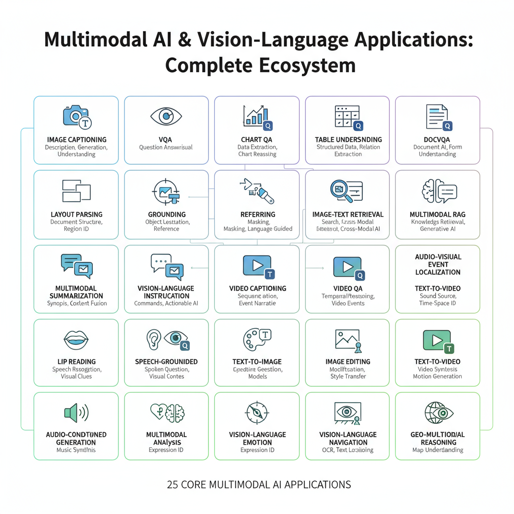

# Multimodal Notebook Catalog

  

| Model | Use case | Deps | Hardware | RAM | Notes | Notebook | Code |
|---|---|---|---|---|---|---|---|
| [CLIP ViT-B/32](https://huggingface.co/openai/clip-vit-base-patch32) openai/clip-vit-base-patch32 | Zero-shot image classification & retrieval | transformers | CPU/GPU/MLX | 4–8GB | Popular baseline; add batching tip | multimodal/multimodal_notebooks/multimodal-01-clip-vit-b-32.ipynb | 🚀 [BLIP image captioning (Salesforce)](https://colab.research.google.com/github/salesforce/BLIP/blob/main/notebooks/demo.ipynb)  |
| [BLIP Captioning Base](https://huggingface.co/Salesforce/blip-image-captioning-base) Salesforce/blip-image-captioning-base | Image captioning on Flickr8k subset | transformers, datasets | CPU/GPU | 8–16GB | GPU recommended; CPU works small batch | multimodal/multimodal_notebooks/multimodal-02-blip-captioning-base.ipynb | 🚀 [BLIP-2 (OPT-2.7B) demo](https://colab.research.google.com/github/salesforce/LAVIS/blob/main/projects/blip2/eval/blip2_eval_demo.ipynb)  |
| [BLIP2 OPT 2.7B](https://huggingface.co/Salesforce/blip2-opt-2.7b) Salesforce/blip2-opt-2.7b | Image captioning with OPT decoder | transformers | CPU/GPU | 16–32GB | Use bf16 on GPU; memory hungry | multimodal/multimodal_notebooks/multimodal-03-blip2-opt-2-7b.ipynb | 🖥️ [CLIP retrieval (text↔image)](https://github.com/huggingface/notebooks/blob/main/examples/image_text_retrieval.ipynb) |
| [CLIP ViT-L/14](https://huggingface.co/laion/CLIP-ViT-L-14) laion/CLIP-ViT-L-14 | High quality cross-modal retrieval | transformers | CPU/GPU | 8–16GB | Use fp16; large checkpoints | multimodal/multimodal_notebooks/multimodal-04-clip-vit-l-14.ipynb | 🚀 [OWL-ViT open-vocabulary detection](https://colab.research.google.com/github/google-research/scenic/blob/main/scenic/projects/owl_vit/notebooks/OWLv2_demo.ipynb)  |
| [OWL-ViT Base](https://huggingface.co/google/owlvit-base-patch32) google/owlvit-base-patch32 | Open vocabulary detection | transformers | CPU/GPU | 8–16GB | Prompt carefully; MIT license | multimodal/multimodal_notebooks/multimodal-05-owl-vit-base.ipynb | 🚀 [Qwen2-VL small demo notebook](https://colab.research.google.com/github/QwenLM/Qwen2-VL/blob/main/notebooks/Qwen2_VL_Colab_Demo.ipynb)  |
| [OWL-ViT Large](https://huggingface.co/google/owlvit-large-patch14) google/owlvit-large-patch14 | Open vocabulary detection high-accuracy | transformers | CPU/GPU | 16–32GB | GPU highly recommended; MIT | multimodal/multimodal_notebooks/multimodal-06-owl-vit-large.ipynb | 🚀 [OpenFlamingo 3B demo](https://colab.research.google.com/github/mlfoundations/open_flamingo/blob/main/notebooks/open_flamingo_vqa_demo.ipynb)  |
| [BLIP VQA Base](https://huggingface.co/Salesforce/blip-vqa-base) Salesforce/blip-vqa-base | Visual question answering | transformers, datasets | CPU/GPU | 8–16GB | Add answer post-process; MIT | multimodal/multimodal_notebooks/multimodal-07-blip-vqa-base.ipynb | 🚀 [LLaVA 1.5 demo (VLM chat)](https://colab.research.google.com/github/haotian-liu/LLaVA/blob/main/docs/colab/llava_colab.ipynb)  |
| [InstructBLIP FLAN-T5 XL](https://huggingface.co/Salesforce/instructblip-flan-t5-xl) Salesforce/instructblip-flan-t5-xl | Instruction tuned VQA | transformers | CPU/GPU | 16–32GB | Use 4-bit to fit 16GB; license MIT | multimodal/multimodal_notebooks/multimodal-08-instructblip-flan-t5-xl.ipynb | 🚀 [Kosmos-2 grounding demo](https://colab.research.google.com/github/microsoft/unilm/blob/master/kosmos-2/notebooks/Kosmos-2_Demo.ipynb)  |
| [OpenFlamingo 3B](https://huggingface.co/mlfoundations/open_flamingo_3b) mlfoundations/open_flamingo_3b | Few-shot multimodal generation | transformers | CPU/GPU | 16–32GB | Requires CLIP vision tower; Apache-2.0 | multimodal/multimodal_notebooks/multimodal-09-openflamingo-3b.ipynb | 🚀 [Florence-2 multi-task vision-language](https://colab.research.google.com/github/microsoft/Florence-2/blob/main/notebooks/florence2_demo.ipynb)  |
| [Qwen2 VL 2B](https://huggingface.co/Qwen/Qwen2-VL-2B-Instruct) Qwen/Qwen2-VL-2B-Instruct | Compact VLM assistant | transformers | CPU/GPU | 16–32GB | Quantize to 4-bit; license Qwen | multimodal/multimodal_notebooks/multimodal-10-qwen2-vl-2b.ipynb | 🚀 [ALBEF retrieval/captioning (LAVIS)](https://colab.research.google.com/github/salesforce/LAVIS/blob/main/projects/albef/eval/albef_eval_demo.ipynb)  |
| [AltCLIP L-m9](https://huggingface.co/BAAI/AltCLIP-L-m9) BAAI/AltCLIP-L-m9 | Chinese-English CLIP | transformers | CPU/GPU | 8–16GB | Great for cross-lingual retrieval | multimodal/multimodal_notebooks/multimodal-11-altclip-l-m9.ipynb | 🚀 [ImageBind (audio-image-text) demo](https://colab.research.google.com/github/facebookresearch/ImageBind/blob/main/notebooks/ImageBind_Demo.ipynb)  |
| [Kosmos-2](https://huggingface.co/microsoft/kosmos-2-patch14-224) microsoft/kosmos-2-patch14-224 | Vision language grounding | transformers | CPU/GPU | 16–32GB | Needs caption prompts; MIT | multimodal/multimodal_notebooks/multimodal-12-kosmos-2.ipynb | 🚀 [CLIP Interrogator (caption from image)](https://colab.research.google.com/github/pharmapsychotic/clip-interrogator/blob/main/clip_interrogator.ipynb)  |
| [Pix2Struct Base](https://huggingface.co/google/pix2struct-base) google/pix2struct-base | UI screenshot to text | transformers | CPU/GPU | 8–16GB | Prepare screenshot datasets; MIT | multimodal/multimodal_notebooks/multimodal-13-pix2struct-base.ipynb | 🚀 [Video-Q&A (Video-LLaVA style)](https://colab.research.google.com/github/LanguageBind/Video-LLaVA/blob/main/colab/Video-LLaVA-1.5-7B-colab.ipynb)  |
| [BLIP2 FLAN-T5 XL](https://huggingface.co/Salesforce/blip2-flan-t5-xl) Salesforce/blip2-flan-t5-xl | Vision-language generation | transformers | CPU/GPU | 16–32GB | Heavy; run fp16; MIT | multimodal/multimodal_notebooks/multimodal-14-blip2-flan-t5-xl.ipynb | 🚀 [Multimodal RAG with CLIP embeddings](https://colab.research.google.com/github/huggingface/notebooks/blob/main/examples/multimodal_retrieval.ipynb)  |
| [Idefics2 8B](https://huggingface.co/HuggingFaceM4/idefics2-8b-instruct) HuggingFaceM4/idefics2-8b-instruct | Large VLM instruction | transformers | CPU/GPU | 32GB+ | Needs multi-GPU or 4-bit; license HF | multimodal/multimodal_notebooks/multimodal-15-idefics2-8b.ipynb | 🚀 [GroundingDINO + SAM pipeline](https://colab.research.google.com/github/IDEA-Research/Grounded-Segment-Anything/blob/main/demo/Grounded_Segment_Anything.ipynb)  |
| [Fuyu 8B](https://huggingface.co/adept/fuyu-8b) adept/fuyu-8b | OCR aware multimodal chat | transformers | CPU/GPU | 32GB+ | Check Adept license; needs kv cache | multimodal/multimodal_notebooks/multimodal-16-fuyu-8b.ipynb | 🚀 [Pix2Struct (screen-to-text) demo](https://colab.research.google.com/github/google-research/pix2struct/blob/main/notebooks/pix2struct_colab_demo.ipynb)  |
| [Stable Diffusion 2.1](https://huggingface.co/stabilityai/stable-diffusion-2-1-base) stabilityai/stable-diffusion-2-1-base | Text to image generation | diffusers, torchvision | CPU/GPU | 16–32GB | GPU strongly advised; CreativeML license | multimodal/multimodal_notebooks/multimodal-17-stable-diffusion-2-1.ipynb | 🚀 [Donut + ViTSTR document VQA](https://colab.research.google.com/github/clovaai/donut/blob/master/demo_docvqa.ipynb)  |
| [SDXL Turbo](https://huggingface.co/stabilityai/sdxl-turbo) stabilityai/sdxl-turbo | Real-time diffusion generation | diffusers | CPU/GPU | 32GB+ | Requires GPU; note non-commercial | multimodal/multimodal_notebooks/multimodal-18-sdxl-turbo.ipynb | 🚀 [CLAP multimodal audio-text retrieval](https://colab.research.google.com/github/LAION-AI/CLAP/blob/main/notebooks/CLAP_demo.ipynb)  |
| [LayoutLMv3 Base](https://huggingface.co/microsoft/layoutlmv3-base) microsoft/layoutlmv3-base | Document question answering | transformers, datasets | CPU/GPU | 8–16GB | Needs layoutlm processor; MIT | multimodal/multimodal_notebooks/multimodal-19-layoutlmv3-base.ipynb | 🚀 [BLIP-2 VQA eval (LAVIS)](https://colab.research.google.com/github/salesforce/LAVIS/blob/main/projects/blip2/eval/vqa_eval.ipynb)  |
| [ImageBind 1.2B](https://huggingface.co/facebook/imagebind-1.2b) facebook/imagebind-1.2b | Unified audio image text embeddings | transformers | CPU/GPU | 16–32GB | Heavy; requires multi modality inputs | multimodal/multimodal_notebooks/multimodal-20-imagebind-1-2b.ipynb | 🚀 [MiniGPT-4 style demo (open variant)](https://colab.research.google.com/github/Vision-CAIR/MiniGPT-4/blob/main/MiniGPT-4.ipynb)  |

_Source of truth: `/meta/notebook_catalog.csv`._
