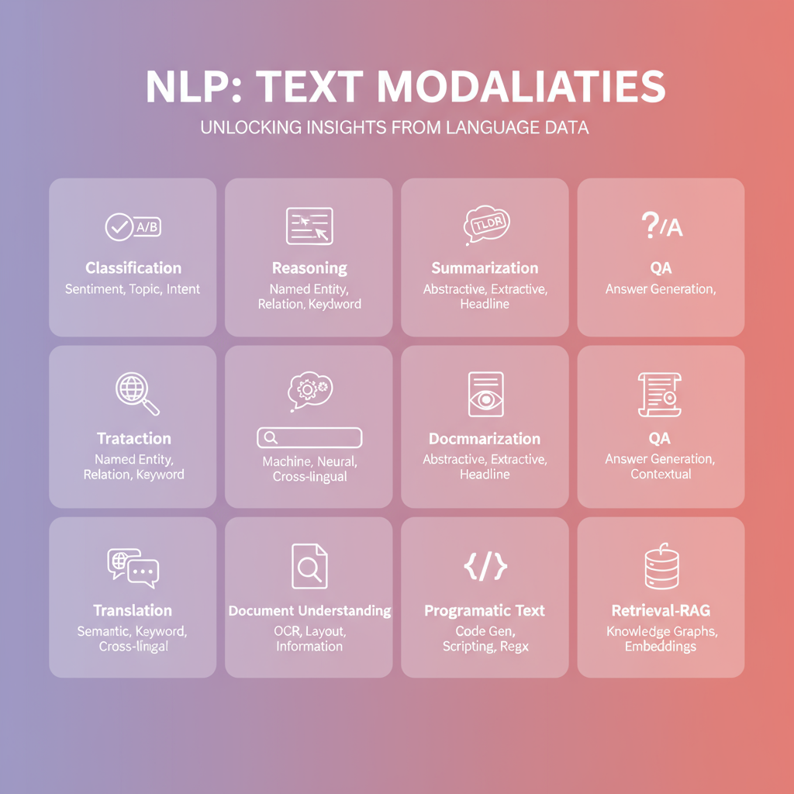

# NLP Notebook Catalog

  

| Model | Use case | Deps | Hardware | RAM | Notes | Notebook | Code |
|---|---|---|---|---|---|---|---|
| [BERT base uncased](https://huggingface.co/bert-base-uncased) bert-base-uncased | Sentiment/IMDB baseline (CPU-first pipeline + LoRA TODO) | transformers, datasets, evaluate | CPU/GPU/MLX | <4GB | Fast CPU; great starter; add LoRA later; license review: Apache-2.0 | nlp/nlp_notebooks/nlp-01-bert-base-uncased.ipynb | 🖥️ [Text classification (BERT/DistilBERT, PyTorch)](https://github.com/huggingface/notebooks/blob/main/examples/text_classification.ipynb) |
| [all-MiniLM-L6-v2](https://huggingface.co/sentence-transformers/all-MiniLM-L6-v2) sentence-transformers/all-MiniLM-L6-v2 | Semantic search embeddings (vector DB ready) | sentence-transformers, transformers | CPU/GPU/MLX | <4GB | Good default for retrieval; multilingual alt available | nlp/nlp_notebooks/nlp-02-all-minilm-l6-v2.ipynb | 🚀 [Text classification (TF/Keras)](https://colab.research.google.com/github/huggingface/notebooks/blob/main/examples/text_classification-tf.ipynb)  |
| [RoBERTa base](https://huggingface.co/roberta-base) roberta-base | Sentiment on social reviews baseline | transformers, datasets, evaluate | CPU/GPU/MLX | 4–8GB | Solid base; add class weighting; license: MIT | nlp/nlp_notebooks/nlp-03-roberta-base.ipynb | 🖥️ [DistilBERT IMDB fine-tuning (HF Course)](https://github.com/huggingface/course/blob/main/chapter3/classification.ipynb) |
| [DistilBERT base uncased](https://huggingface.co/distilbert-base-uncased) distilbert-base-uncased | Real-time sentiment microservice | transformers, datasets | CPU/GPU/MLX | <4GB | Great for quantization tests; low latency | nlp/nlp_notebooks/nlp-04-distilbert-base-uncased.ipynb | 🚀 [RoBERTa sentiment (GLUE SST-2) Trainer](https://colab.research.google.com/github/huggingface/notebooks/blob/main/examples/pytorch/quicktour.ipynb)  |
| [RoBERTa QA SQuAD2](https://huggingface.co/deepset/roberta-base-squad2) deepset/roberta-base-squad2 | Extractive QA over policy docs | transformers, datasets | CPU/GPU/MLX | 4–8GB | Chunk long inputs; add citation spans | nlp/nlp_notebooks/nlp-05-roberta-qa-squad2.ipynb | 🖥️ [Token classification / NER (BERT)](https://github.com/huggingface/notebooks/blob/main/examples/token_classification.ipynb) |
| [T5 Small](https://huggingface.co/t5-small) t5-small | Abstractive summarization quickstart | transformers, datasets, evaluate | CPU/GPU/MLX | 4–8GB | CPU okay with batch=1; add ROUGE eval | nlp/nlp_notebooks/nlp-06-t5-small.ipynb | 🖥️ [Question answering (SQuAD, BERT)](https://github.com/huggingface/notebooks/blob/main/examples/question_answering.ipynb) |
| [BART base](https://huggingface.co/facebook/bart-base) facebook/bart-base | News summarization baseline | transformers, datasets, evaluate | CPU/GPU | 8–16GB | Prefer GPU for beams; license: MIT | nlp/nlp_notebooks/nlp-07-bart-base.ipynb | 🖥️ [Summarization (T5/BART)](https://github.com/huggingface/notebooks/blob/main/examples/summarization.ipynb) |
| [FLAN-T5 base](https://huggingface.co/google/flan-t5-base) google/flan-t5-base | Instruction following snippets | transformers | CPU/GPU | 8–16GB | Great with prompt templates; add safety note | nlp/nlp_notebooks/nlp-08-flan-t5-base.ipynb | 🖥️ [Translation (Marian / Helsinki-NLP)](https://github.com/huggingface/notebooks/blob/main/examples/translation.ipynb) |
| [OPUS-MT EN-HI](https://huggingface.co/Helsinki-NLP/opus-mt-en-hi) Helsinki-NLP/opus-mt-en-hi | En↔Hi translation starter | transformers | CPU/GPU | 4–8GB | Download tokenizer offline; quality mid-tier | nlp/nlp_notebooks/nlp-09-opus-mt-en-hi.ipynb | 🚀 [Instruction-tuned FLAN-T5 generation](https://colab.research.google.com/github/huggingface/notebooks/blob/main/examples/text_generation.ipynb)  |
| [mBART-50 M2M](https://huggingface.co/facebook/mbart-large-50-many-to-many-mmt) facebook/mbart-large-50-many-to-many-mmt | Multilingual translation playground | transformers | CPU/GPU | 8–16GB | Needs sentencepiece; license review: CC-BY-NC | nlp/nlp_notebooks/nlp-10-mbart-50-m2m.ipynb | 🚀 [LoRA/QLoRA with PEFT (sequence classification)](https://colab.research.google.com/github/huggingface/notebooks/blob/main/examples/peft/peft_training_text_classification.ipynb)  |
| [E5 Base v2](https://huggingface.co/intfloat/e5-base-v2) intfloat/e5-base-v2 | Dense retrieval embedding pipeline | transformers, datasets | CPU/GPU/MLX | 4–8GB | Pair with FAISS; bilingual ready | nlp/nlp_notebooks/nlp-11-e5-base-v2.ipynb | 🚀 [LoRA/QLoRA for causal-LM (generation)](https://colab.research.google.com/github/huggingface/notebooks/blob/main/examples/peft/peft_lora_int8_int4.ipynb)  |
| [BGE Small EN](https://huggingface.co/BAAI/bge-small-en) BAAI/bge-small-en | Search embeddings lightweight | transformers | CPU/GPU/MLX | <4GB | CPU friendly; add normalization step | nlp/nlp_notebooks/nlp-12-bge-small-en.ipynb | 🖥️ [Sentence-Transformers semantic search (all-MiniLM)](https://www.sbert.net/examples/applications/semantic-search/README.html) |
| [Jina Embeddings Base](https://huggingface.co/jinaai/jina-embeddings-v2-base-en) jinaai/jina-embeddings-v2-base-en | Hybrid retrieval embeddings | transformers | CPU/GPU | 4–8GB | Enable batching for speed; license review: MIT | nlp/nlp_notebooks/nlp-13-jina-embeddings-base.ipynb | 🖥️ [SBERT multilingual retrieval](https://www.sbert.net/examples/applications/semantic-search/semantic_search_ml-qa/README.html) |
| [MXBAI Rerank XSmall](https://huggingface.co/mixedbread-ai/mxbai-rerank-xsmall-v1) mixedbread-ai/mxbai-rerank-xsmall-v1 | Cross-encoder reranking for search | transformers | CPU/GPU | 4–8GB | Use top-k=50; consider int8 | nlp/nlp_notebooks/nlp-14-mxbai-rerank-xsmall.ipynb | 🖥️ [bge-* embeddings quickstart](https://github.com/FlagOpen/FlagEmbedding/blob/master/docs/text_embedding/quick_start_EN.md) |
| [German BERT base](https://huggingface.co/deepset/gbert-base) deepset/gbert-base | German NER for support tickets | transformers | CPU/GPU | 4–8GB | Requires cased text; license review: MIT | nlp/nlp_notebooks/nlp-15-german-bert-base.ipynb | 🖥️ [e5 embeddings & retrieval](https://github.com/intfloat/e5-mistral-7b-instruct#usage) |
| [DeBERTa v3 base](https://huggingface.co/microsoft/deberta-v3-base) microsoft/deberta-v3-base | Intent classification upgrades | transformers, datasets | CPU/GPU | 8–16GB | Better accuracy; needs ONNX export tip | nlp/nlp_notebooks/nlp-16-deberta-v3-base.ipynb | 🖥️ [Reranking with mixedbread-ai / Cross-Encoders](https://www.sbert.net/examples/applications/cross-encoder/README.html) |
| [Paraphrase MPNet Multilingual](https://huggingface.co/sentence-transformers/paraphrase-multilingual-mpnet-base-v2) sentence-transformers/paraphrase-multilingual-mpnet-base-v2 | Paraphrase detection multilingual | sentence-transformers, transformers | CPU/GPU/MLX | 4–8GB | Great for semantic dedupe; license: Apache-2.0 | nlp/nlp_notebooks/nlp-17-paraphrase-mpnet-multilingual.ipynb | 🚀 [DistilBERT QA (Trainer + evaluate)](https://colab.research.google.com/github/huggingface/notebooks/blob/main/examples/question_answering-tf.ipynb)  |
| [Gemma 2B IT](https://huggingface.co/google/gemma-2b-it) google/gemma-2b-it | Compact instruction chat | transformers | CPU/GPU | 8–16GB | Runs on 12GB GPU; Gemma license review | nlp/nlp_notebooks/nlp-18-gemma-2b-it.ipynb | 🚀 [Pipeline zero-shot classification](https://colab.research.google.com/github/huggingface/notebooks/blob/main/examples/pipeline_tutorial.ipynb)  |
| [Mistral 7B Instruct](https://huggingface.co/mistralai/Mistral-7B-Instruct-v0.2) mistralai/Mistral-7B-Instruct-v0.2 | Advanced instruction generation | transformers | CPU/GPU | 32GB+ | Use 4-bit quant on GPU; Apache-2.0 | nlp/nlp_notebooks/nlp-19-mistral-7b-instruct.ipynb | 🖥️ [Datasets streaming + tokenization (large corpora)](https://github.com/huggingface/course/blob/main/chapter5/processing.ipynb) |
| [GTE Base](https://huggingface.co/Alibaba-NLP/gte-base) Alibaba-NLP/gte-base | Dual-encoder retrieval baseline | transformers | CPU/GPU/MLX | 4–8GB | Normalize embeddings; multilingual ready | nlp/nlp_notebooks/nlp-20-gte-base.ipynb | 🖥️ [Evaluate metrics (accuracy/F1/ROUGE)](https://github.com/huggingface/notebooks/blob/main/examples/evaluate.ipynb) |

_Source of truth: `/meta/notebook_catalog.csv`._
