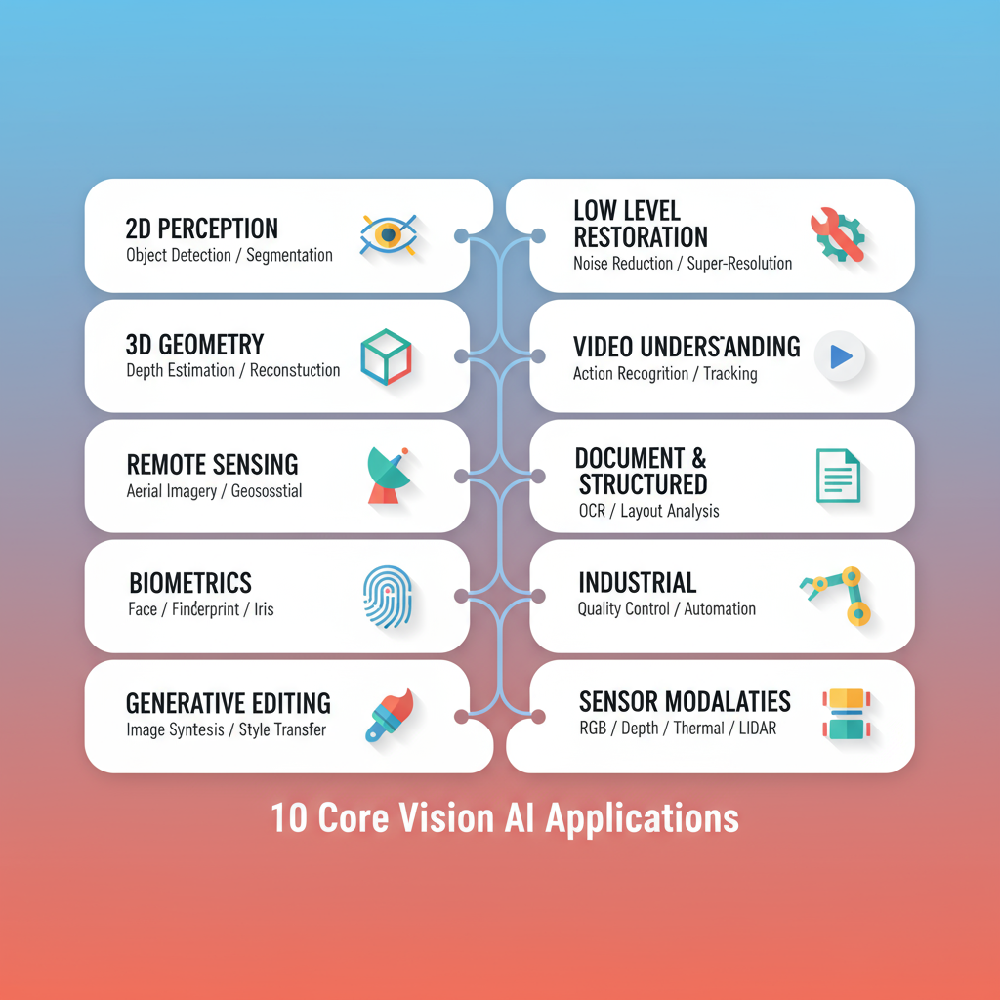

# Vision Notebook Catalog

  

| Model | Use case | Deps | Hardware | RAM | Notes | Notebook | Code |
|---|---|---|---|---|---|---|---|
| [ViT Base 224](https://huggingface.co/google/vit-base-patch16-224) google/vit-base-patch16-224 | Image classification baseline (Imagenette) | transformers, datasets, timm | CPU/GPU/MLX | 4–8GB | Simple fine-tune; CPU okay; MPS expected | vision/vision_notebooks/vision-01-vit-base-224.ipynb | 🖥️ [ViT image classification (Imagenette)](https://github.com/huggingface/notebooks/blob/main/examples/image_classification.ipynb) |
| [DETR ResNet-50](https://huggingface.co/facebook/detr-resnet-50) facebook/detr-resnet-50 | Object detection on sample images | transformers, torchvision | CPU/GPU | 8–16GB | GPU recommended; CPU slow; MPS expected; check license | vision/vision_notebooks/vision-02-detr-resnet-50.ipynb | 🖥️ [CLIP zero-shot classification](https://github.com/huggingface/notebooks/blob/main/examples/zero_shot_image_classification.ipynb) |
| [ResNet-50](https://huggingface.co/microsoft/resnet-50) microsoft/resnet-50 | Classic classification transfer | torchvision, timm | CPU/GPU/MLX | 4–8GB | Great for benchmarking augmentations | vision/vision_notebooks/vision-03-resnet-50.ipynb | 🖥️ [CLIP retrieval (text↔image)](https://github.com/huggingface/notebooks/blob/main/examples/image_text_retrieval.ipynb) |
| [CLIP ViT-B LAION](https://huggingface.co/laion/CLIP-ViT-B-32-laion2B-s34B-b79K) laion/CLIP-ViT-B-32-laion2B-s34B-b79K | Zero-shot retrieval large corpus | transformers | CPU/GPU | 4–8GB | Needs fp16 on GPU; license review: LAION | vision/vision_notebooks/vision-04-clip-vit-b-laion.ipynb | 🖥️ [DETR object detection (COCO-style)](https://github.com/huggingface/notebooks/blob/main/examples/object_detection.ipynb) |
| [CLIP ViT-L/14](https://huggingface.co/openai/clip-vit-large-patch14) openai/clip-vit-large-patch14 | High-accuracy zero-shot classification | transformers | CPU/GPU | 8–16GB | Heavy on CPU; prefer GPU; license review | vision/vision_notebooks/vision-05-clip-vit-l-14.ipynb | 🖥️ [SegFormer semantic segmentation](https://github.com/huggingface/notebooks/blob/main/examples/semantic_segmentation.ipynb) |
| [SegFormer B0 ADE](https://huggingface.co/nvidia/segformer-b0-finetuned-ade-512-512) nvidia/segformer-b0-finetuned-ade-512-512 | Semantic segmentation quickstart | transformers | CPU/GPU | 8–16GB | Resize inputs carefully; MIT license | vision/vision_notebooks/vision-06-segformer-b0-ade.ipynb | 🚀 [Mask2Former segmentation (HF example)](https://colab.research.google.com/github/huggingface/notebooks/blob/main/examples/vision_mask2former.ipynb)  |
| [Conditional DETR](https://huggingface.co/microsoft/conditional-detr-resnet-50) microsoft/conditional-detr-resnet-50 | Detection with conditional queries | transformers, torchvision | CPU/GPU | 8–16GB | Tune for small objects; add eval script | vision/vision_notebooks/vision-07-conditional-detr.ipynb | 🚀 [SAM – Segment Anything demo](https://colab.research.google.com/github/facebookresearch/segment-anything/blob/main/notebooks/automatic_mask_generator_example.ipynb)  |
| [DPT Hybrid MiDaS](https://huggingface.co/facebook/dpt-hybrid-midas) facebook/dpt-hybrid-midas | Monocular depth estimation | transformers | CPU/GPU/MLX | 8–16GB | Use fp16 on GPU; good for robotics | vision/vision_notebooks/vision-08-dpt-hybrid-midas.ipynb | 🚀 [GroundingDINO open-vocabulary detection](https://colab.research.google.com/github/IDEA-Research/GroundingDINO/blob/main/demo/GroundingDINO_Demo.ipynb)  |
| [DPT Large](https://huggingface.co/intel/dpt-large) intel/dpt-large | High quality depth maps | transformers | CPU/GPU | 16–32GB | Memory heavy; crop inputs; Apache-2.0 | vision/vision_notebooks/vision-09-dpt-large.ipynb | 🚀 [TrOCR OCR (printed text)](https://colab.research.google.com/github/huggingface/notebooks/blob/main/examples/ocr.ipynb)  |
| [TrOCR Base Printed](https://huggingface.co/microsoft/trocr-base-printed) microsoft/trocr-base-printed | Printed OCR pipeline | transformers, datasets | CPU/GPU | 4–8GB | Needs pillow + sentencepiece; MIT | vision/vision_notebooks/vision-10-trocr-base-printed.ipynb | 🚀 [Donut document understanding (OCR-free)](https://colab.research.google.com/github/clovaai/donut/blob/master/demo.ipynb)  |
| [DiT OCR Base](https://huggingface.co/microsoft/dit-base-finetuned-ocr) microsoft/dit-base-finetuned-ocr | Document OCR with layout | transformers | CPU/GPU | 8–16GB | Enable fp16; license review: MIT | vision/vision_notebooks/vision-11-dit-ocr-base.ipynb | 🚀 [DPT / MiDaS depth estimation](https://colab.research.google.com/github/isl-org/MiDaS/blob/master/notebooks/midas.ipynb)  |
| [SAM ViT Base](https://huggingface.co/facebook/sam-vit-base) facebook/sam-vit-base | Segment anything interactive | transformers | CPU/GPU | 16–32GB | Large prompts; license review: SAM | vision/vision_notebooks/vision-12-sam-vit-base.ipynb | 🚀 [Depth-Anything HF demo notebook](https://colab.research.google.com/github/LiheYoung/Depth-Anything/blob/main/notebooks/depth_anything_v2_demo.ipynb)  |
| [Grounding DINO Tiny](https://huggingface.co/IDEA-Research/grounding-dino-tiny) IDEA-Research/grounding-dino-tiny | Grounded object detection | transformers | CPU/GPU | 8–16GB | Requires grounding tokens; license review: Apache-2.0 | vision/vision_notebooks/vision-13-grounding-dino-tiny.ipynb | 🚀 [Pose estimation with MMPose + HF datasets](https://colab.research.google.com/github/open-mmlab/mmpose/blob/main/demo/MMPose_Tutorial.ipynb)  |
| [MobileViT Small](https://huggingface.co/apple/mobilevit-small) apple/mobilevit-small | Edge image classification | transformers | CPU/GPU/MLX | <4GB | Great on mobile; MIT license | vision/vision_notebooks/vision-14-mobilevit-small.ipynb | 🖥️ [Image feature extraction (ViT as encoder)](https://github.com/huggingface/notebooks/blob/main/examples/image_feature_extraction.ipynb) |
| [Mask2Former Swin Base](https://huggingface.co/facebook/mask2former-swin-base-ade20k-semantic) facebook/mask2former-swin-base-ade20k-semantic | Semantic segmentation advanced | transformers | CPU/GPU | 16–32GB | Prefer GPU; add sliding window | vision/vision_notebooks/vision-15-mask2former-swin-base.ipynb | 🚀 [BLIP image–text retrieval](https://colab.research.google.com/github/salesforce/BLIP/blob/main/notebooks/demo.ipynb)  |
| [YOLOv8n](https://huggingface.co/ultralytics/yolov8n) ultralytics/yolov8n | Real-time detection baseline | ultralytics, torchvision | CPU/GPU/MLX | 4–8GB | Export to ONNX easily; AGPL license review | vision/vision_notebooks/vision-16-yolov8n.ipynb | 🚀 [LayoutLMv3 document layout tasks](https://colab.research.google.com/github/huggingface/notebooks/blob/main/examples/layoutlmv3_document_ai.ipynb)  |
| [BEiT Base](https://huggingface.co/microsoft/beit-base-patch16-224-pt22k-ft22k) microsoft/beit-base-patch16-224-pt22k-ft22k | Vision transformer fine-tuning | transformers | CPU/GPU | 8–16GB | Strong baseline; needs data aug | vision/vision_notebooks/vision-17-beit-base.ipynb | 🚀 [Owl-ViT open-vocabulary detection](https://colab.research.google.com/github/google-research/scenic/blob/main/scenic/projects/owl_vit/notebooks/OWLv2_demo.ipynb)  |
| [ConvNeXtV2 Tiny](https://huggingface.co/facebook/convnextv2-tiny-1k-224) facebook/convnextv2-tiny-1k-224 | Modern convnet baseline | transformers | CPU/GPU | 4–8GB | Fast inference; record top-1 | vision/vision_notebooks/vision-18-convnextv2-tiny.ipynb | 🚀 [Florence-2 zero-shot vision tasks](https://colab.research.google.com/github/microsoft/Florence-2/blob/main/notebooks/florence2_demo.ipynb)  |
| [Depth Anything Small](https://huggingface.co/google/depth-anything-small-hf) google/depth-anything-small-hf | Fast monocular depth | transformers | CPU/GPU | 4–8GB | Runs on MPS; great for AR | vision/vision_notebooks/vision-19-depth-anything-small.ipynb | 🚀 [Vision fine-tune with timm + HF](https://colab.research.google.com/github/huggingface/notebooks/blob/main/examples/vision_timm_finetune.ipynb)  |
| [DINOv2 Base](https://huggingface.co/facebook/dinov2-base) facebook/dinov2-base | Self-supervised feature extractor | transformers | CPU/GPU | 8–16GB | Use for retrieval; MIT license | vision/vision_notebooks/vision-20-dinov2-base.ipynb | 🖥️ [Diffusers image generation quickstart](https://github.com/huggingface/notebooks/blob/main/diffusers/stable_diffusion/stable_diffusion_intro.ipynb) |

_Source of truth: `/meta/notebook_catalog.csv`._
